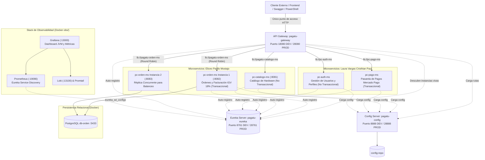

# 💻 ChaskiPC Hardware E-Commerce - Ecosistema Distribuido
> Plataforma de comercio electrónico distribuido para la cotización y venta de computadoras ensambladas, periféricos y piezas de hardware con verificación de stock en tiempo real y pasarela de pagos.
> **Sistema Distribuido Base Orientado a Producción (Unidad 1 Completa - Sesiones S01 a S05)**

[](https://spring.io/projects/spring-boot)
[](https://spring.io/projects/spring-cloud)
[](https://openjdk.org/projects/jdk/21/)
[](https://www.postgresql.org/)
[](https://www.docker.com/)

---

## 👥 1. Datos del Equipo e Integrantes
* **Nombre del equipo:** Equipo 01 - ChaskiByte Systems
* **Sección:** 5to Ciclo - Grupo Único
* **Curso:** Desarrollo de Aplicaciones Distribuidas (2026-2)
* **Docente:** Ing. Abel Ángel Sullón Macalupu
* **Repositorio Oficial:** [https://github.com/jaisesasaki24-cloud/ChaskiByte-Systems](https://github.com/jaisesasaki24-cloud/ChaskiByte-Systems)

### 🏷️ Topics del Repositorio
`campus-juliaca` · `semestre-2026-2` · `linea-software` · `tipo-ps` · `dist` · `seccion-g1` · `grupo-01-chaskipc`

### 📋 Asignación de Roles y Microservicios (2 Microservicios por Integrante)
| Integrante | Rol en el Proyecto | Microservicio Transaccional | Microservicio No Transaccional |
| :--- | :--- | :--- | :--- |
| **Eliceo Parillo Mostajo** | Arquitectura backend, órdenes de compra y catálogo de hardware | `pc-orden-ms` (Cabecera-Detalle, IGV 18%, PostgreSQL :5433) | `pc-catalogo-ms` (Catálogo de Hardware Gamer y Stock :8081) |
| **Laura Vargas Cristhian Paul** | Pasarela de pagos externa, seguridad y autenticación | `pc-pago-ms` (Pasarela Mercado Pago Sandbox y Webhooks) | `pc-auth-ms` (Gestión de Usuarios y Seguridad Perimetral) |

---

## 🏛️ 2. Arquitectura del Sistema Distribuido Base (Unidad 1)



---

## 🗺️ 3. Matriz Integral de Mapeo del Sistema Distribuido

El sistema cuenta con un mapeo exhaustivo y desacoplado en cada una de sus capas operacionales:

### 3.1 Mapeo de Enrutamiento en API Gateway (`pagatu-gateway` :18080)
| Ruta Pública Expuesta | Destino Lógico (Eureka) | Balanceador / Modo | Microservicio Destino | Descripción de Negocio |
| :--- | :--- | :---: | :--- | :--- |
| `GET /api/v1/categorias/**` | `lb://pagatu-catalogo-ms` | Directo | `pc-catalogo-ms` (:8081) | Consulta de familias de hardware |
| `GET /api/v1/productos/**` | `lb://pagatu-catalogo-ms` | Directo | `pc-catalogo-ms` (:8081) | Catálogo de componentes y stock |
| `POST /api/v1/productos` | `lb://pagatu-catalogo-ms` | Directo | `pc-catalogo-ms` (:8081) | Alta de componentes tecnológicos |
| `GET /api/v1/ordenes/**` | `lb://pagatu-orden-ms` | **Round Robin** | `pc-orden-ms` (:8082, :8083) | Histórico de compras y detalle |
| `POST /api/v1/ordenes` | `lb://pagatu-orden-ms` | **Round Robin** | `pc-orden-ms` (:8082, :8083) | Emisión de orden con 18% de IGV |
| `PUT /api/v1/ordenes/{id}/estado` | `lb://pagatu-orden-ms` | **Round Robin** | `pc-orden-ms` (:8082, :8083) | Transición de estado (`PAGADO`, etc.) |
| `POST /api/v1/pagos/**` | `lb://pc-pago-ms` | Directo | `pc-pago-ms` | Integración Mercado Pago Sandbox |
| `POST /api/v1/auth/**` | `lb://pc-auth-ms` | Directo | `pc-auth-ms` | Identidad, login y JWT |

### 3.2 Mapeo de Registro Dinámico en Eureka (`pagatu-eureka` :8761)
| Application Name (`spring.application.name`) | Instance ID Mapeado | Puerto DEV | Puerto PROD | Estado Eureka |
| :--- | :--- | :---: | :---: | :---: |
| `PAGATU-GATEWAY` | `pagatu-gateway:18080` | 18080 | 28080 | `UP` |
| `PAGATU-CONFIG` | `pagatu-config:8888` | 8888 | 28888 | `UP` |
| `PAGATU-CATALOGO-MS` | `pagatu-catalogo-ms:8081` | 8081 | Dinámico | `UP` |
| `PAGATU-ORDEN-MS` (Instancia 1) | `pagatu-orden-ms:8082` | 8082 | Dinámico | `UP` |
| `PAGATU-ORDEN-MS` (Instancia 2) | `pagatu-orden-ms:8083` | 8083 | Dinámico | `UP` |

### 3.3 Mapeo Objeto-Relacional JPA Cabecera-Detalle (PostgreSQL :5433)
* **Cabecera `Orden` (`@Table(name = "ordenes")`):**  
  * `id` (PK IDENTITY), `codigo_orden`, `cliente`, `cliente_id`, `subtotal`, `igv` (18%), `total`, `estado`, `tipo_comprobante`, `metodo_pago`.  
  * Mapeo de relación: `@OneToMany(mappedBy = "orden", cascade = CascadeType.ALL, orphanRemoval = true) @JsonManagedReference`
* **Detalle `DetalleOrden` (`@Table(name = "orden_detalles")`):**  
  * `id` (PK IDENTITY), `orden_id` (FK a `ordenes.id`), `producto_id`, `nombre_producto`, `precio_unitario`, `cantidad`, `subtotal_item`.  
  * Mapeo de relación: `@ManyToOne(fetch = FetchType.LAZY) @JoinColumn(name = "orden_id") @JsonBackReference`
* **Mitigación Jackson:** Los decoradores `@JsonManagedReference` y `@JsonBackReference` eliminan cualquier bucle cíclico en la serialización JSON.

### 3.4 Mapeo de Códigos de Respuesta HTTP Estandarizados
| Método HTTP | Endpoint Mapeado | Código Exitoso | Código Fallo | Criterio de Activación |
| :--- | :--- | :---: | :---: | :--- |
| `POST` | `/api/v1/ordenes` | **`201 Created`** | `400 Bad Request` | Retorna 201 con payload creado. Retorna 400 si `cliente` es nulo/vacío. |
| `GET` | `/api/v1/ordenes` | **`200 OK`** | - | Retorna la colección completa de órdenes. |
| `GET` | `/api/v1/ordenes/{id}` | **`200 OK`** | **`404 Not Found`** | Retorna 200 con la orden desglosada o 404 si el ID no existe en BD. |
| `PUT` | `/api/v1/ordenes/{id}/estado` | **`200 OK`** | `400` / `404` | Modifica estado de orden. Retorna 400 si estado es vacío o 404 si ID no existe. |
| `DELETE` | `/api/v1/ordenes/{id}` | **`204 No Content`** | **`404 Not Found`** | Borra orden si existe (204) o devuelve 404 Not Found. |
| `GET` | `/api/v1/productos` | **`200 OK`** | - | Retorna lista de hardware o filtra por `?categoriaId=`. |
| `POST` | `/api/v1/productos` | **`201 Created`** | `400 Bad Request` | Da de alta un nuevo producto gamer. |

---

## 📂 4. Estructura del Repositorio

```text
ChaskiByte-Systems/
├── config-repo/                     # Repositorio centralizado de configuraciones (DEV y PROD)
│   ├── application.yml
│   ├── pagatu-gateway-dev.yml       # Rutas lb:// y reglas de Gateway
│   ├── pagatu-orden-ms-dev.yml      # DB PostgreSQL y Eureka Client
│   ├── pagatu-catalogo-ms-dev.yml   # Catálogo JPA y Eureka Client
│   └── ...
├── pagatu-config/                   # Spring Cloud Config Server (Puerto 8888)
├── pagatu-eureka/                   # Netflix Eureka Service Discovery (Puerto 8761)
├── pagatu-gateway/                  # Spring Cloud Gateway no bloqueante (Puerto 18080)
├── pagatu-catalogo-ms/              # Catálogo ChaskiPC: Categorías y Productos (Puerto 8081)
├── pagatu-orden-ms/                 # Órdenes ChaskiPC: Cabecera-Detalle e IGV (Puertos 8082, 8083)
├── obs/                             # Docker Compose de Observabilidad (Prometheus, Grafana, Loki)
│   ├── compose-dev.yml
│   ├── prometheus/
│   └── grafana/
├── infra/                           # Docker Compose de Producción Local (Red pagatu-prod-net)
│   └── compose.yml
├── BRIEF_TECNICO.md                 # Documento técnico oficial del proyecto sello ChaskiPC
├── S03_Equipo01_ParilloEliceo.pdf   # Informe de Sesión 03 (Eureka & Múltiples Instancias)
├── S04_Equipo01_ParilloEliceo.pdf   # Informe de Sesión 04 (API Gateway & Balanceo de Carga)
├── S05_Equipo01_ParilloEliceo.pdf   # Informe Oficial de Evaluación y Cierre de la Unidad I
├── iniciar_db.bat                   # Script de 1 clic para arrancar PostgreSQL (Puerto 5433)
├── iniciar_todo.bat                 # Lanzador universal Windows (autodetecta Python o PowerShell)
├── iniciar_todo.ps1                 # Lanzador nativo en PowerShell puro (cero dependencias)
├── iniciar_todo.py                  # Lanzador en Python con rutas relativas dinámicas
└── README.md
```

---

## 🚀 5. Guía de Ejecución en Entorno Local (DEV)

### Requisitos Previos:
* **Java Development Kit (JDK 21)**
* **Docker Desktop** (para PostgreSQL y observabilidad)

### Paso 1: Levantar Bases de Datos y Observabilidad
```powershell
# Levantar PostgreSQL
cd "pagatu-orden-ms"
docker compose -f compose-dev.yml up -d

# Levantar Observabilidad (Prometheus + Grafana + Loki)
cd "../obs"
docker compose -f compose-dev.yml up -d
```

### Paso 2: Ejecutar los Servicios de Infraestructura y Negocio
Puedes hacer doble clic en `iniciar_todo.bat` o abrir terminales independientes en PowerShell:

```powershell
# 1. Config Server (Puerto 8888)
cd "pagatu-config"
.\mvnw.cmd spring-boot:run

# 2. Eureka Server (Puerto 8761)
cd "pagatu-eureka"
.\mvnw.cmd spring-boot:run

# 3. API Gateway - Punto Único de Acceso (Puerto 18080)
cd "pagatu-gateway"
.\mvnw.cmd spring-boot:run

# 4. Catálogo de Hardware (Puerto 8081)
cd "pagatu-catalogo-ms"
.\mvnw.cmd spring-boot:run

# 5. Órdenes ChaskiPC - Instancia 1 (Puerto 8082)
cd "pagatu-orden-ms"
.\mvnw.cmd spring-boot:run

# 6. Órdenes ChaskiPC - Instancia 2 (Puerto 8083)
cd "pagatu-orden-ms"
.\mvnw.cmd spring-boot:run -Dspring-boot.run.arguments="--server.port=8083"
```

---

## 🧪 5. Catálogo de Endpoints y Pruebas a través del Gateway (Puerto 18080)

### 🛒 Microservicio de Catálogo de Hardware (`pc-catalogo-ms`)
| Método | Endpoint vía Gateway | Descripción |
| :--- | :--- | :--- |
| `GET` | `http://localhost:18080/api/v1/categorias` | Lista categorías (Procesadores, GPUs, RAM, etc.) |
| `GET` | `http://localhost:18080/api/v1/productos` | Catálogo completo con stock y precios |
| `GET` | `http://localhost:18080/api/v1/productos?categoriaId=1` | Filtro de componentes por categoría |
| `GET` | `http://localhost:18080/api/v1/productos/sku/CPU-AMD-001` | Ficha técnica por SKU de hardware |
| `POST` | `http://localhost:18080/api/v1/productos` | Registra un nuevo componente de hardware |

### 📦 Microservicio de Órdenes (`pc-orden-ms`)
| Método | Endpoint vía Gateway | Descripción |
| :--- | :--- | :--- |
| `GET` | `http://localhost:18080/api/v1/ordenes` | Listar todas las órdenes (balanceado Round Robin) |
| `GET` | `http://localhost:18080/api/v1/ordenes/{id}` | Consultar orden por ID con detalle e IGV |
| `POST` | `http://localhost:18080/api/v1/ordenes` | Registrar orden con ítems, comprobante y pago |
| `PUT` | `http://localhost:18080/api/v1/ordenes/{id}/estado` | Actualizar estado (`PAGADO`, `CANCELADO`, etc.) |
| `DELETE` | `http://localhost:18080/api/v1/ordenes/{id}` | Eliminar orden |

```powershell
# Ejemplo: Crear orden estructurada con ítems por el Gateway
$orden = @{
    cliente = "Eliceo Parillo Mostajo"
    tipoComprobante = "FACTURA"
    metodoPago = "TARJETA"
    detalles = @(
        @{ productoId = 1; nombreProducto = "AMD Ryzen 7 7800X3D"; precioUnitario = 1780.00; cantidad = 1 },
        @{ productoId = 3; nombreProducto = "Corsair DDR5 32GB"; precioUnitario = 520.00; cantidad = 2 }
    )
} | ConvertTo-Json -Depth 5

Invoke-RestMethod -Method Post -Uri "http://localhost:18080/api/v1/ordenes" -Body $orden -ContentType "application/json"
```

---

## 📑 6. Entregables Académicos Oficiales
* 📄 [**`BRIEF_TECNICO.md`**](BRIEF_TECNICO.md): Ficha técnica oficial del proyecto sello ChaskiPC.
* 📄 [**`S01_Equipo01_ParilloEliceo.pdf`**](pagatu-orden-ms/S01_Equipo01_ParilloEliceo.pdf): Informe de la Sesión 01 (Construcción del Microservicio Base, persistencia inicial y escalado horizontal).
* 📄 [**`S03_Equipo01_ParilloEliceo.pdf`**](S03_Equipo01_ParilloEliceo.pdf): Informe de la Sesión 03 (Eureka Server, Múltiples Instancias, Observabilidad).
* 📄 [**`S04_Equipo01_ParilloEliceo.pdf`**](S04_Equipo01_ParilloEliceo.pdf): Informe de la Sesión 04 (API Gateway, Rutas `lb://` y Balanceo de Carga).
* 📄 [**`S05_Equipo01_ParilloEliceo.pdf`**](S05_Equipo01_ParilloEliceo.pdf): **Informe Oficial de Evaluación y Sustentación de la Unidad I** (Balotario de defensa teórico-práctica resuelto y rúbrica de 20 pts).

---

## 🛠️ 7. Bitácora de Despliegue DevOps: Resolución de los 7 Desafíos Técnicos de Portabilidad (DTI-Laboratorio)

Al trasladar el ecosistema a las máquinas de laboratorio universitario (**DTI-Laboratorio**), se superaron 7 problemas técnicos clásicos de portabilidad y dependencias en microservicios:

| # | Problema Detectado | Causa Raíz | Solución Técnica Implementada |
| :-: | :--- | :--- | :--- |
| **1** | **Rutas quemadas (Hardcoded Paths)** | `iniciar_todo.py` buscaba rutas absolutas de la máquina origen (`C:\Users\USUARIO\...`). | Refactorización a rutas relativas con `os.path.dirname(os.path.abspath(__file__))` y `$MyInvocation.MyCommand.Path`. 100% portable a cualquier PC o USB. |
| **2** | **Falta del intérprete de Python** | El `.bat` fallaba en máquinas de laboratorio sin Python en PATH. | Instalación rápida (`winget install Python.Python.3.12`), creación del script nativo `iniciar_todo.ps1` (PowerShell puro) y `.bat` con fallback automático. |
| **3** | **Incompatibilidad Java (`release 21 not supported`)** | `JAVA_HOME` apuntaba a Java 17 preinstalado a pesar de tener JDK 21 en disco. | Actualización con `setx /M JAVA_HOME "..."` e inyección automática preventiva de `$env:JAVA_HOME` en cada consola lanzada. |
| **4** | **Conflicto de comillas en PowerShell (Instancia 2)** | PowerShell fragmentaba `-Dspring-boot.run.arguments="--server.port=8083"`. | Desacoplamiento usando variable de entorno nativa de Spring: `$env:SERVER_PORT='8083'; .\mvnw.cmd spring-boot:run`. |
| **5** | **Config Server desconectado (`DataSource url is not specified`)** | `search-locations` apuntaba a la ruta estática de la PC anterior, entregando YAMLs vacíos. | Parametrización dinámica en `application.yml` con `${CONFIG_REPO_PATH:file:../config-repo}` e inyección por script. |
| **6** | **Servidor PostgreSQL apagado (`Connection refused: 5433`)** | Los contenedores Docker de la base de datos estaban detenidos (`Exited`). | Creación de `infra/docker-compose-db.yml` y script de un solo clic `iniciar_db.bat`. |
| **7** | **Error de autenticación (`password failed for user "admin"`)** | El contenedor se creó con usuario `postgres`, mientras el código requería `admin` / `adminpassword`. | Sentencias DDL/DCL en PostgreSQL y declaración estandarizada en `docker-compose-db.yml`. |

### ⚡ Lanzadores Disponibles en el Repositorio

* **`iniciar_infra_completa.bat`**: Levanta en 1 solo clic PostgreSQL (5433) + Prometheus (19090) + Grafana (13000) + Loki (13100) + Promtail.
* **`iniciar_observabilidad.bat`**: Levanta únicamente el stack de monitoreo (Prometheus, Grafana, Loki y Promtail).
* **`iniciar_db.bat`**: Levanta el contenedor PostgreSQL `chaskipc-db-orden` en el puerto 5433 con `orden_db` y usuario `admin`.
* **`iniciar_todo.bat`**: Doble clic para arrancar el ecosistema completo (auto-inicia Docker, verifica Java 21 y abre los 5 microservicios en terminales independientes).
* **`iniciar_todo.ps1`**: Lanzador 100% nativo de PowerShell sin necesidad de Python.
* **`iniciar_todo.py`**: Lanzador en Python con rutas dinámicas relativas.
* **`limpiar_pc_laboratorio.bat`**: Script preventivo para liberar puertos y matar procesos huérfanos antes de exponer en la PC de laboratorio.

---

## 🖥️ 8. Materiales de Sustentación y Presentación a Dos Voces (Sesión 05)

* 🌐 **[`presentacion.html`](presentacion.html)**: **Presentación Web Interactiva tipo PowerPoint a Dos Voces** (F11 para pantalla completa) con el **Centro de Mando de Demostración en Vivo** (enlaces directos a Eureka, Gateway, Config Server y botones de copiado rápido con comandos asignados por expositor).
* 📊 **[`presentacion.pptx`](presentacion.pptx)**: Diapositivas nativas en **Microsoft PowerPoint (16:9)** con las 11 láminas completas y roles desglosados para **Eliceo Parillo Mostajo** y **Laura Vargas Cristhian Paul**.
* 📖 **[`PRESENTACION.md`](PRESENTACION.md)**: Guion oficial de sustentación a dos voces con desglose de 18 minutos (8 min presentación técnica, 5 min demo en vivo, 5 min balotario de preguntas).
* 📑 **[`S05_Equipo01_ParilloEliceo.pdf`](S05_Equipo01_ParilloEliceo.pdf)**: Informe técnico formal de evaluación con balotario y rúbrica de 20 puntos resueltos.
