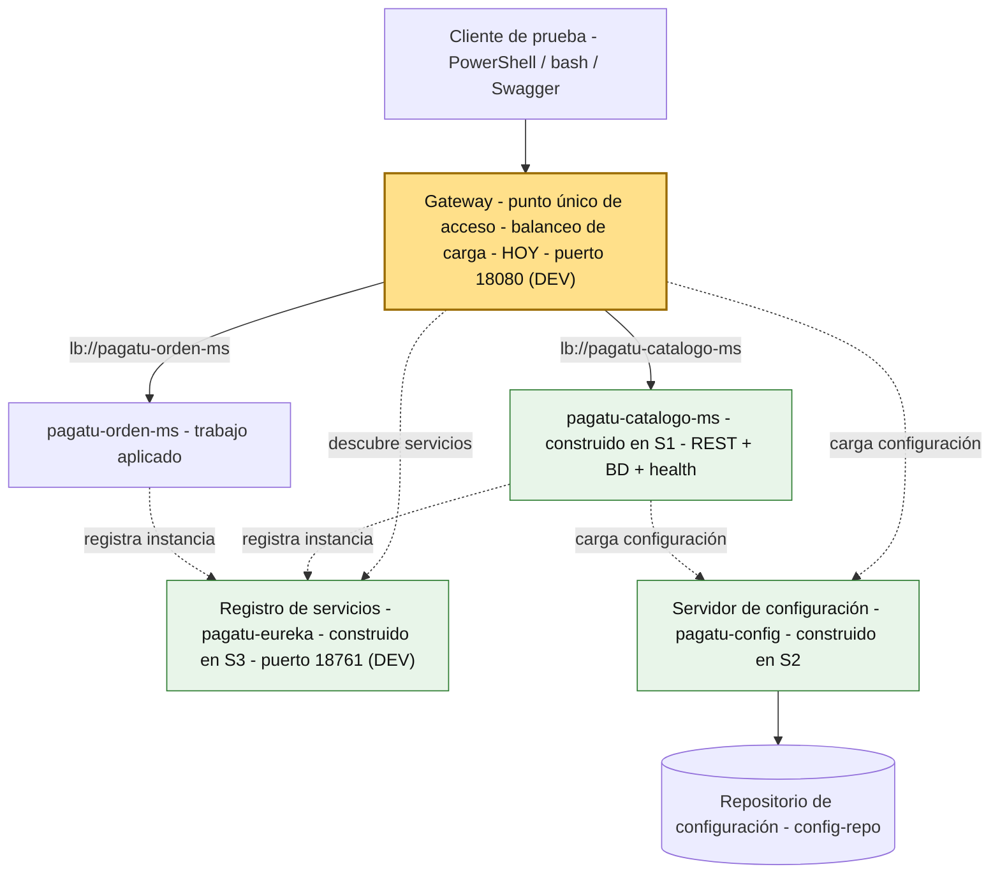
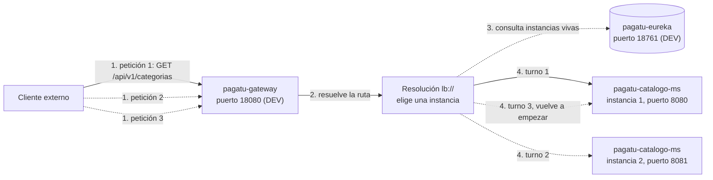
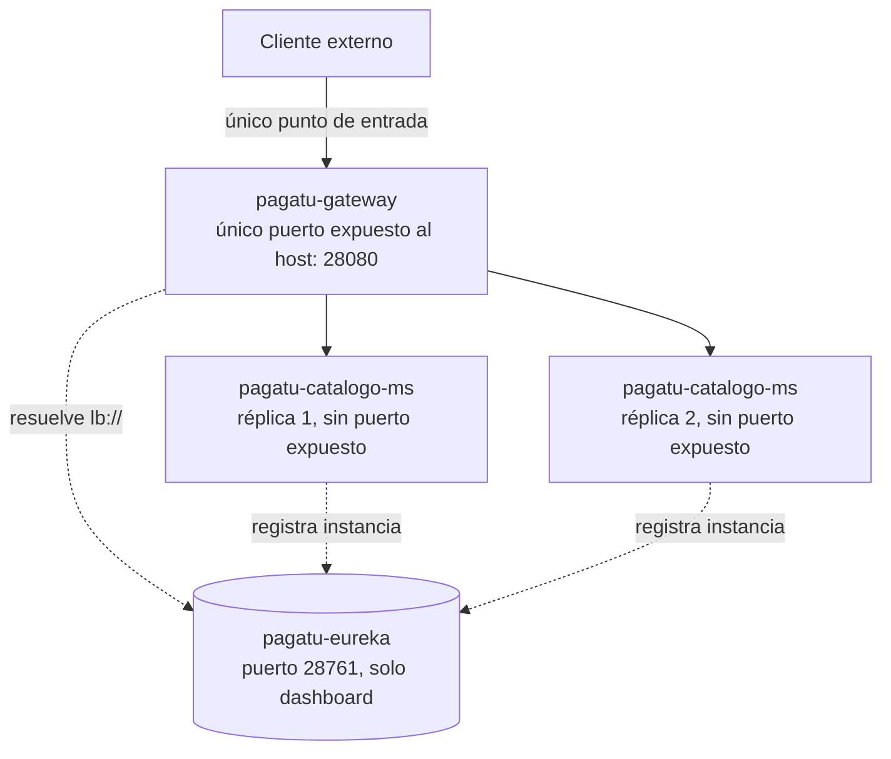
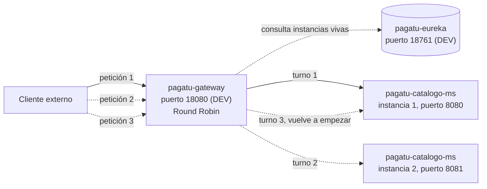
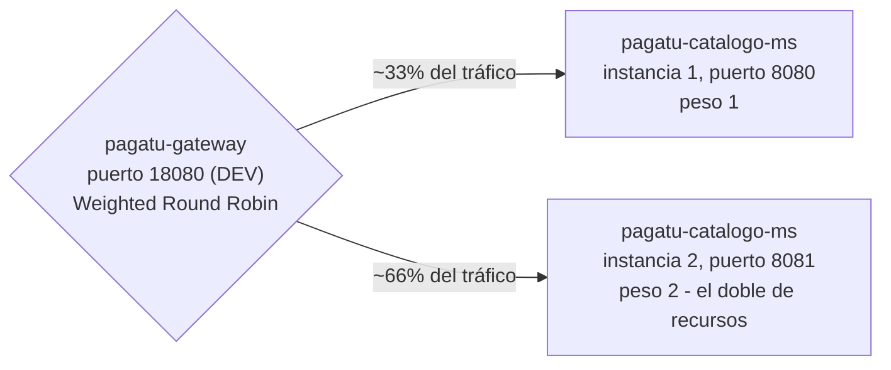
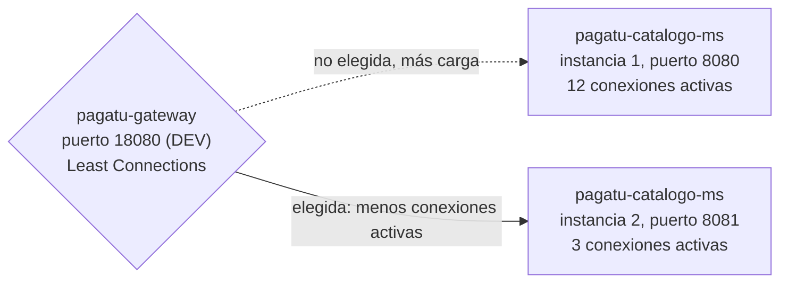
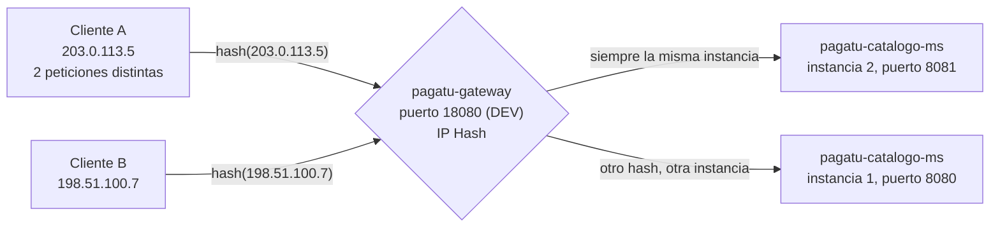
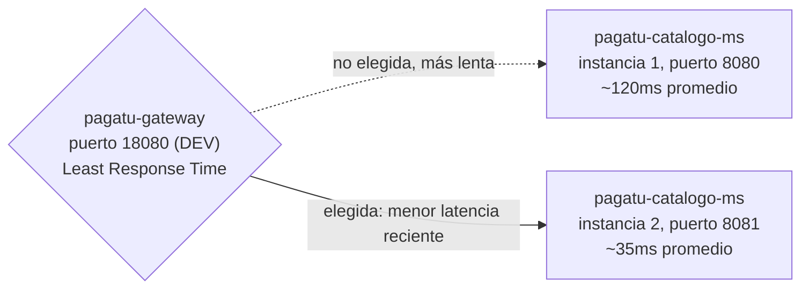

# S4 - Punto Único de Acceso y Distribución de Tráfico

*Por: Angel Sullon Macalupu @asullom - 2026*

## 1. Introducción

Tiempo: 20 min.

### 1.1 Presentación de la sesión

Aunque el registro y descubrimiento de servicios ya resuelve que ningún componente necesite memorizar direcciones a mano, quien prueba el sistema desde afuera — un cliente real, no otro microservicio — todavía tiene que conocer el puerto exacto de cada instancia y decidir a cuál llamar. Esta sesión resuelve exactamente eso: un único punto de entrada que recibe todas las peticiones externas, resuelve el servicio correcto por su nombre lógico y reparte el tráfico entre las instancias disponibles, sin que quien llama sepa nunca cuántas hay ni en qué puerto responde cada una.

### 1.2 Índice

1. Punto único de acceso.
2. Distribución de tráfico entre instancias.

### 1.3 Propósito de aprendizaje

Al concluir la clase, estarás en condiciones de:

- **Configurar e implementar** un punto único de acceso que enrute peticiones hacia los servicios ya registrados y reparta el tráfico entre sus instancias disponibles, sin que quien consume el sistema conozca puertos ni direcciones individuales.

### 1.4 Producto de sesión

`pagatu-gateway` operativo en `infra/pagatu-gateway`, con rutas hacia `pagatu-catalogo-ms` (`/api/v1/categorias`, `/api/v1/productos`) resueltas mediante `lb://` sobre el registro de `pagatu-eureka`, balanceando tráfico entre sus dos instancias (`8080`/`8081`, S3), verificado con múltiples peticiones consecutivas al mismo punto de entrada.

### 1.5 Metodología

**Tabla 1. Metodología de la sesión**

| Actividades a Realizar en el Periodo | Orientaciones generales (Orientaciones Metodológicas) | Material de estudio recomendado |
|---|---|---|
| Revisión previa individual | Confirmar que `pagatu-eureka` y las dos instancias de `pagatu-catalogo-ms` (S3) siguen registrándose en DEV. Trabajo individual, antes de clase; identificar qué puerto habría que usar hoy para llamar a cada instancia sin ningún componente nuevo. | Evidencia individual de S3, dashboard de `pagatu-eureka`. |
| Clase presencial | Construcción guiada de `pagatu-gateway`, con rutas hacia `pagatu-catalogo-ms` y balanceo de carga verificado entre sus dos instancias. Trabajo individual, siguiendo al docente paso a paso; consulta inmediata ante una ruta que no resuelve. Quien cuente con los recursos de cómputo puede continuar con Grafana (3.7, opcional) y con producción local (3.8, opcional). | Pasos 3.1 a 3.6 de esta guía (3.7-3.8 son opcionales). |
| Evaluación formativa | Revisión en clase de `pagatu-gateway` respondiendo por HTTP y de al menos dos peticiones consecutivas resueltas por instancias distintas. La evidencia se completa y sustenta de forma individual, fuera del aula, según los criterios mínimos de la sección 4.4. | Indicaciones de entrega (4.3), rúbrica de evaluación (4.6). |

### 1.6 Motivación de la sesión

#### 1.6.1 Caso: el puerto que el cliente ya no debería conocer

Con dos instancias de `pagatu-catalogo-ms` registradas en `pagatu-eureka` (sesión 3), un cliente que prueba a mano —PowerShell, Swagger— sigue escribiendo `localhost:8080` o `localhost:8081`: el registro le sirve a otro microservicio, o a una herramienta de observabilidad, pero no a ese cliente externo, que nunca consulta a Eureka por su cuenta. Si mañana aparece una tercera instancia, o una de las dos existentes se cae, ese cliente sigue apuntando a un puerto fijo que puede dejar de responder — nadie le avisa que la topología cambió.

La solución no es que el cliente aprenda a consultar Eureka también — es que nunca necesite hacerlo: un único punto de entrada recibe la petición, resuelve el nombre lógico por su cuenta, y decide a qué instancia enviarla. El cliente solo conoce una dirección, siempre la misma, sin importar cuántas instancias haya detrás ni cuál de ellas responda esta vez.

**Preguntas de análisis**

**Activación de conocimientos previos**

1. En la sesión 3, ¿qué componente consultaba a `pagatu-eureka` por nombre lógico, y qué componente seguía necesitando el puerto exacto de cada instancia?

**Comprensión del punto único de acceso**

1. Si un cliente externo llamara directamente a `pagatu-catalogo-ms:8081` y esa instancia se cayera, ¿qué pasaría con esa petición? ¿Cambiaría algo si el cliente llamara al punto único de acceso en vez de al puerto directo?
2. ¿Por qué "repartir tráfico entre instancias" necesita primero "encontrar las instancias disponibles" — y por qué eso ya estaba resuelto desde la sesión anterior?

### 1.7 Ubicación en el curso

- Unidad: U1 - Sistema distribuido base orientado a producción.
- Producto del curso: sistema distribuido de microservicios end-to-end, configurable, escalable, seguro, resiliente, consistente, observable, integrado con frontend y defendido técnicamente.
- Producto de unidad: sistema distribuido base funcional, configurable y preparado para múltiples instancias.
- Avance del producto en esta sesión: punto único de acceso operativo, con rutas resueltas por descubrimiento y tráfico repartido entre instancias.

**Figura 1. Roadmap del producto de la unidad**



Hoy se construye `pagatu-gateway` con rutas hacia `pagatu-catalogo-ms`, ya registrado con dos instancias desde S3. `pagatu-orden-ms` (todavía sin Config Client ni Eureka Client, según se haya completado o no el trabajo autónomo de S3) recibe su propia ruta como trabajo autónomo de esta sesión (sección 4) — el mismo patrón, aplicado sobre el segundo microservicio.

## 2. Explica

Tiempo: 25 min.

### 2.1 Arquitectura de la sesión

**Figura 2. De la petición externa a la instancia que la atiende**



Lectura del diagrama: el cliente ya no llama a `pagatu-catalogo-ms` — llama a `pagatu-gateway`, siempre a la misma dirección. `pagatu-gateway` reconoce la ruta por su `Path` (2.3), resuelve `lb://pagatu-catalogo-ms` preguntándole a `pagatu-eureka` qué instancias están vivas en ese instante, y reenvía cada petición a una instancia distinta, en turnos — la primera petición cae en la instancia 1, la segunda en la instancia 2, la tercera vuelve a la instancia 1. Quien prueba a mano ya no necesita escribir `:8080` ni `:8081`: las tres peticiones usan siempre `18080`, sin que el cliente note ninguna diferencia en la respuesta. Este diagrama es el mapa que guía el resto de la explicación: cada apartado siguiente desarrolla uno de sus componentes, en el mismo orden del Índice (1.2) — incluyendo el propio algoritmo de turnos, que 2.3 retoma con su propio diagrama (Figura 4).

Ese flujo es el mismo en DEV y en producción local — lo que cambia entre un ambiente y otro no es *cómo* resuelve el Gateway, sino *quién más puede llegar directo a una instancia sin pasar por él*:

**Figura 3. Punto único de acceso en producción local**



En DEV (Figura 2), cualquiera puede seguir llamando directo a `localhost:8080` o `:8081` — los microservicios corren con Maven en el host, con sus puertos fijos abiertos, precisamente para poder probarlos uno por uno mientras se aprende (3.5-3.6). En producción local, eso deja de ser posible a propósito: `services/pagatu-catalogo-ms/compose.yml` ya trae el puerto de sus réplicas comentado desde S2 (`#ports: #  - "28080:8080"`) — ninguna réplica publica nada al host, solo son alcanzables dentro de `pagatu-prod-net`. `pagatu-gateway` (3.8, opcional) es el único componente que expone un puerto **de negocio** (`28080`, tráfico real de la API): el punto único de acceso, llevado a su consecuencia real — no es solo que el cliente *prefiera* pasar por el Gateway, es que en producción **no tiene otra forma de llegar** a un microservicio. `pagatu-eureka` sí sigue exponiendo su puerto (`28761`, en `infra/compose.yml` desde S3) — pero solo para que el equipo revise su dashboard desde el host; ningún cliente de negocio le pega directo a `28761`, la única puerta de entrada para tráfico real sigue siendo `28080`.

### 2.2 Punto único de acceso

Un **Gateway** (o *API Gateway*) es el componente que recibe todo el tráfico externo de un sistema distribuido y lo reenvía hacia el microservicio correcto — el cliente conoce una sola dirección, nunca la topología interna del sistema. Sin Gateway, cada cliente tendría que conocer la dirección de cada microservicio (y de cada una de sus instancias) por separado; agregar un microservicio nuevo, o escalar uno existente, obligaría a actualizar a **todos** los clientes que lo llaman directamente.

Según SACAViX System Design (2026), un API Gateway centraliza el punto de entrada de un sistema distribuido, ocultando la topología interna y permitiendo aplicar en un solo lugar preocupaciones transversales (enrutamiento, balanceo de carga, y más adelante en el curso, autenticación) que de otro modo se repetirían en cada microservicio.

**Error frecuente**: pensar que el Gateway reemplaza al registro de servicios (`pagatu-eureka`, S3). No lo reemplaza — lo consume. El Gateway sigue necesitando saber qué instancias existen y están vivas; lo que cambia es *quién* le pregunta eso a Eureka: antes, cada cliente potencial; ahora, un único componente, una sola vez por petición.

**Punto único de acceso y balanceo de carga no son el mismo patrón, aunque en esta sesión se construyan juntos.** SACAViX System Design los documenta por separado: la propia página de *API Gateway* lista *Load Balancing* como patrón **relacionado**, no como parte de su definición — porque cada uno resuelve un problema distinto y puede existir sin el otro. Un balanceador de carga puro (por ejemplo, un ALB de AWS repartiendo tráfico entre instancias de un único servicio) no enruta nada por ruta ni oculta ninguna topología de microservicios; un Gateway podría enrutar peticiones hacia servicios que tienen una sola instancia cada uno, sin repartir nada entre copias. Lo que hace `pagatu-gateway` es **componer** los dos: cuando resuelve una ruta con `uri: lb://...` (2.3), delega la elección de instancia a Spring Cloud LoadBalancer — una librería distinta, con su propia responsabilidad — en vez de reimplementar el balanceo dentro del enrutador. Spring Cloud Gateway los junta por conveniencia de configuración, no porque sean, en el fondo, el mismo patrón.

Esa composición tiene un costo que SACAViX System Design (2026) también documenta como *trade-off* del API Gateway, no solo una ventaja: si `pagatu-gateway` se cae, el sistema entero queda sin punto de entrada, aunque las dos instancias de `pagatu-catalogo-ms` sigan perfectamente vivas — un único punto de acceso es, también, un único punto de fallo. Esta sesión no resuelve eso (implica correr varias instancias del propio Gateway, con su propio balanceo por delante); solo lo deja documentado como una limitación real, no oculta, de lo que se construye hoy.

### 2.3 Distribución de tráfico entre instancias

Una **ruta** en el Gateway conecta un patrón de entrada (qué peticiones atrapa) con un destino. En Spring Cloud Gateway, una ruta se define con tres piezas:

- **`id`**: nombre de la ruta, solo para identificarla en configuración y logs.
- **`predicates`**: condición que decide si una petición entra por esta ruta — la más común es `Path`, que compara la URL de la petición contra un patrón.
- **`uri`**: destino de la ruta. El esquema `lb://` (*load-balanced*) es la pieza clave: en vez de una dirección fija (`http://localhost:8080`), `lb://pagatu-catalogo-ms` le dice al Gateway "resuelve este nombre lógico contra el registro, y elige una instancia viva" — exactamente lo mismo que ya hace cualquier cliente de Eureka (S3, 2.4), aplicado ahora a nivel de ruta.

El **balanceo de carga** es la decisión de *cuál* instancia recibe cada petición, entre todas las que el registro reporta como vivas en ese instante. Spring Cloud LoadBalancer (el balanceador que resuelve el esquema `lb://`) usa por defecto `RoundRobinLoadBalancer`: reparte las peticiones en turnos, una instancia después de otra, sin favorecer ninguna — la primera petición a una instancia, la segunda a la otra, la tercera de vuelta a la primera. Nadie lo eligió a mano en `pagatu-gateway` (3.4) — es lo que Spring Cloud LoadBalancer usa si no se le indica otra cosa.

**Figura 4. Round Robin, el algoritmo que usa `pagatu-gateway` hoy**



Es el algoritmo activo en `pagatu-gateway` sin ninguna configuración adicional (3.4-3.6): cada petición nueva a `lb://pagatu-catalogo-ms` consulta a `pagatu-eureka` qué instancias siguen vivas, y cae en la instancia siguiente del turno, alternando 8080/8081 en orden fijo. La verificación de 3.6 (peticiones repetidas contra `18080`, revisando qué instancia respondió cada vez por su log) es, en el fondo, observar este mismo diagrama en vivo.

**Cómo se cambiaría** (fuera del alcance de esta sesión, solo para que quede claro que es configuración, no una limitación fija): Spring Cloud LoadBalancer trae un segundo algoritmo listo para usar, `RandomLoadBalancer` (elige una instancia al azar en cada petición, en vez de por turnos). Se activa declarando una configuración específica para el servicio, con `@LoadBalancerClient`:

```java
@LoadBalancerClient(name = "pagatu-catalogo-ms", configuration = CatalogoLoadBalancerConfig.class)
public class PagatuGatewayApplication { /* ... */ }

class CatalogoLoadBalancerConfig {
    @Bean
    ReactorLoadBalancer<ServiceInstance> randomLoadBalancer(
            Environment environment, LoadBalancerClientFactory factory) {
        String name = environment.getProperty(LoadBalancerClientFactory.PROPERTY_NAME);
        return new RandomLoadBalancer(
            factory.getLazyProvider(name, ServiceInstanceListSupplier.class), name);
    }
}
```

`RoundRobinLoadBalancer` y `RandomLoadBalancer` son los dos únicos algoritmos que Spring Cloud LoadBalancer trae listos para usar. Los otros que documenta SACAViX System Design (2026) — *Weighted Round Robin*, *Least Connections*, *IP Hash/Consistent Hashing*, *Least Response Time* — no vienen incluidos: implementarlos exige escribir una clase propia de balanceo (misma interfaz `ReactorServiceInstanceLoadBalancer` que ya usan los dos anteriores), trabajo real, no una propiedad de configuración. Por eso quedan fuera del alcance de esta sesión — se documentan aquí como panorama, no como algo que se construye hoy.

**Figura 5. Weighted Round Robin, sobre las instancias de hoy**



Reparte proporcional al peso asignado a cada instancia — necesario con hardware heterogéneo. Las dos instancias de `pagatu-catalogo-ms` de hoy corren en la misma máquina, con la misma capacidad: no hay ningún peso real que asignar, por eso *round-robin* sin pesos ya reparte parejo.

**Figura 6. Least Connections, sobre las instancias de hoy**



Envía cada petición nueva a la instancia con menos conexiones activas en ese instante — útil cuando las conexiones duran tiempos muy distintos (WebSockets de larga duración mezclados con peticiones HTTP cortas). Las peticiones de hoy (`GET /api/v1/categorias`) son todas cortas y de duración parecida: contar conexiones activas no aportaría una decisión distinta a la de repartir por turnos.

**Figura 7. IP Hash / Consistent Hashing, sobre las instancias de hoy**



Calcula un hash a partir de la IP del cliente (u otro identificador) para que el mismo cliente siempre golpee la misma instancia — necesario solo si el servicio guarda estado en memoria local, que se perdería si la siguiente petición del mismo cliente cayera en otra instancia. `pagatu-catalogo-ms` no guarda ningún estado propio en memoria — su único estado real vive en `pagatu_catalogo_db` (PostgreSQL), compartido por ambas instancias por igual; no hay nada que "recordar" de un cliente entre una petición y la siguiente.

**Figura 8. Least Response Time, sobre las instancias de hoy**



Combina conexiones activas con la latencia reciente de cada instancia, enviando tráfico a la que responde más rápido con menos carga — el más preciso de los cinco, también el más costoso de operar, porque exige monitorear tiempos de respuesta en vivo. Con dos instancias idénticas, sin diferencia real de capacidad ni de carga, no hay ninguna latencia distinta que detectar.

Las dos instancias de `pagatu-catalogo-ms` de esta sesión son idénticas en capacidad y no guardan ningún estado propio — exactamente el escenario donde *round-robin*, el más simple de los cinco, ya es suficiente. Elegir un algoritmo más sofisticado sin una razón real (como las de las cuatro figuras anteriores) no mejora nada — solo agrega complejidad operacional donde no hace falta.

Aislando solo la diferencia entre `uri: http://...` (una dirección fija) y `uri: lb://...` (2.2) — misma ruta, mismo Gateway, mismo `predicates`, la única variable es si el destino se resuelve por balanceo o no:

`pagatu-eureka` (S3) sigue corriendo en los dos casos, y las dos instancias de `pagatu-catalogo-ms` siguen registrándose en él exactamente igual — lo que cambia no es si Eureka existe, sino si **esta ruta en particular** lo consulta. Con `uri: http://localhost:8080`, el Gateway nunca le pregunta nada al registro: envía la petición a esa dirección literal, exista o no esa instancia en ese momento, esté registrada o no, sin importar cuántas otras instancias estén vivas — el registro sigue ahí, simplemente nadie lo mira para esta ruta. Con `uri: lb://pagatu-catalogo-ms`, el Gateway sí consulta a `pagatu-eureka` en cada petición, y recién ahí el balanceador elige entre las instancias que el registro reporta vivas.

**Tabla 2. Sin balanceo de carga y con balanceo de carga**

| | Ruta sin balanceo (`uri: http://localhost:8080`) | Ruta con balanceo (`uri: lb://pagatu-catalogo-ms`) |
|---|---|---|
| ¿Esta ruta consulta a `pagatu-eureka`? | No — la dirección ya está fija en la propia ruta | Sí, en cada petición, para saber qué instancias siguen vivas |
| Cuántas instancias puede atender la ruta | Una sola, la que esté escrita en la dirección | Todas las que el registro reporte vivas en ese momento |
| Qué pasa si esa instancia recibe más tráfico del que soporta | Toda la carga cae sobre ella, sin alternativa | Se reparte entre las instancias disponibles |
| Qué pasa si se agrega una instancia nueva | Nadie la usa hasta que alguien edite la ruta a mano | Empieza a recibir tráfico en cuanto se registra, sin tocar la ruta |
| Qué pasa si esa instancia se cae | El Gateway le sigue enviando tráfico, y falla | El Gateway deja de enviarle tráfico en cuanto el registro la retira |
| Quién decide qué instancia atiende cada petición | Nadie decide — siempre la misma, fija en la ruta | El balanceador de carga, con el algoritmo elegido (arriba) |

**Tabla 3. Antes y después del punto único de acceso**

| | Sin Gateway (hasta S3) | Con Gateway (desde hoy) |
|---|---|---|
| Dirección que conoce el cliente | Una por instancia (`:8080`, `:8081`, ...) | Una sola, fija |
| Qué pasa si una instancia se cae | El cliente que apuntaba ahí falla | El Gateway deja de enviarle tráfico; el cliente no lo nota |
| Qué pasa si se agrega una instancia nueva | Ningún cliente existente la usa, a menos que se actualice a mano | El Gateway empieza a repartirle tráfico también, sin cambios en el cliente |
| Quién decide a qué instancia va cada petición | El propio cliente (a mano, escribiendo el puerto) | El balanceador de carga, automáticamente |

## 3. Aplica: actividad práctica guiada

Tiempo: 2h.

**Actividad:** construcción guiada de `pagatu-gateway`, con rutas hacia `pagatu-catalogo-ms` resueltas por descubrimiento y balanceo de carga verificado entre sus dos instancias (Producto de la sesión en 1.4).

**Propósito de la actividad:** que un cliente externo llame siempre a la misma dirección, sin conocer cuántas instancias de `pagatu-catalogo-ms` existen ni en qué puerto responde cada una, verificando con evidencia real que el tráfico se reparte entre ellas.

**Orientaciones metodológicas:** en el laboratorio, el docente construye `pagatu-gateway` paso a paso frente a la clase, verificando cada ruta antes de avanzar; los estudiantes replican cada paso en su propio equipo, con las dos instancias de `pagatu-catalogo-ms` (S3) ya corriendo antes de empezar.

**Actividades para realizar:**

- **3.1** Verificar el punto de partida.
- **3.2** Crear el proyecto `pagatu-gateway`.
- **3.3** Configurar `pagatu-gateway` como Config Client.
- **3.4** Crear la configuración de `pagatu-gateway` en `config-repo`, con sus rutas.
- **3.5** Probar `pagatu-gateway` en DEV.
- **3.6** Verificar balanceo de carga entre instancias.
- **3.7** (opcional, anexo) Grafana sobre Prometheus y Loki.
- **3.8** (opcional) Punto único de acceso en producción local.

### 3.1 Verificar el punto de partida

**Punto de partida común:** todo el equipo debe comenzar exactamente desde el mismo estado, no desde su propio avance individual. Clona la rama `s03-registro-descubrimiento` (el snapshot de cierre de S3 — incluye `pagatu-eureka` y `pagatu-catalogo-ms` registrado):

```bash
git clone --branch s03-registro-descubrimiento https://github.com/262dist/pagatu.git
```

**Producto del paso:** confirmación de que `pagatu-config`, `pagatu-eureka` y dos instancias de `pagatu-catalogo-ms` siguen registrándose en DEV, antes de tocar código nuevo.

**Requisito antes de continuar:**

```powershell
cd infra/pagatu-config
.\mvnw.cmd spring-boot:run
```

En otra terminal:

```powershell
cd infra/pagatu-eureka
.\mvnw.cmd spring-boot:run
```

En dos terminales más, una instancia en cada una (mismo mecanismo de S3, 3.9):

```powershell
cd services/pagatu-catalogo-ms
docker compose -f compose-dev.yml up -d
.\mvnw.cmd spring-boot:run
```

```powershell
cd services/pagatu-catalogo-ms
.\mvnw.cmd spring-boot:run "-Dspring-boot.run.arguments=--server.port=8081"
```

Confirma que `http://localhost:18761` muestra dos instancias de `PAGATU-CATALOGO-MS`, ambas `UP`. Si falla, el problema es anterior a esta sesión (S1-S3), no de los pasos 3.2 en adelante.

### 3.2 Crear el proyecto `pagatu-gateway`

**Producto del paso:** proyecto Spring Boot `pagatu-gateway` creado dentro de `infra/pagatu-gateway`.

Desde VS Code, usa Spring Initializr (`Spring Initializr: Create a Maven Project`):

**Tabla 4. Configuración del proyecto `pagatu-gateway` en Spring Initializr**

| Campo | Valor |
|---|---|
| Project | Maven Project |
| Spring Boot | La última estable que ofrezca Spring Initializr en ese momento (verificado: **4.0.8**) |
| Language | Java |
| Group Id | `pe.edu.upeu` |
| Artifact Id | `pagatu-gateway` |
| Package name | `pe.edu.upeu.gateway` |
| Packaging | Jar |
| Java | 21 |
| Ubicación sugerente | `infra/pagatu-gateway` |

Dependencias a seleccionar:

**Tabla 5. Dependencias del proyecto `pagatu-gateway`**

| Grupo | Dependencias | Propósito |
|---|---|---|
| Spring Cloud Routing | Gateway | Enrutamiento y balanceo de carga (2.2, 2.3) |
| Spring Cloud | Config Client | Leer configuración desde `pagatu-config` |
| Spring Cloud Discovery | Eureka Discovery Client | Resolver `lb://` contra `pagatu-eureka` |
| Ops | Spring Boot Actuator | Verificar health de `pagatu-gateway` |
| Productividad | Spring Boot DevTools | Facilitar ejecución en desarrollo |

En `pom.xml`, las dependencias clave:

```xml
<dependency>
    <groupId>org.springframework.cloud</groupId>
    <artifactId>spring-cloud-starter-gateway</artifactId>
</dependency>
<dependency>
    <groupId>org.springframework.cloud</groupId>
    <artifactId>spring-cloud-starter-netflix-eureka-client</artifactId>
</dependency>
```

Mismo BOM de Spring Cloud que ya usan `pagatu-config` y `pagatu-eureka` (S2, S3) — Spring Initializr elige la versión compatible con la versión de Spring Boot seleccionada:

```xml
<properties>
    <java.version>21</java.version>
    <spring-cloud.version>2025.1.3</spring-cloud.version>
</properties>

<dependencyManagement>
    <dependencies>
        <dependency>
            <groupId>org.springframework.cloud</groupId>
            <artifactId>spring-cloud-dependencies</artifactId>
            <version>${spring-cloud.version}</version>
            <type>pom</type>
            <scope>import</scope>
        </dependency>
    </dependencies>
</dependencyManagement>
```

`pagatu-gateway` no necesita ninguna clase ni anotación adicional más allá de la que Spring Initializr ya genera (`@SpringBootApplication`) — a diferencia de `pagatu-eureka` (S3, 3.3), que sí necesitaba `@EnableEurekaServer` para activarse como servidor. Gateway y descubrimiento se activan solos por la sola presencia de las dependencias en el `pom.xml`; todo el comportamiento real se define en configuración (3.4), no en código.

### 3.3 Configurar `pagatu-gateway` como Config Client

**Producto del paso:** `pagatu-gateway` preparado para leer su propia configuración desde `pagatu-config` — el mismo patrón que ya siguen `pagatu-catalogo-ms` (S2) y `pagatu-eureka` (S3).

En `infra/pagatu-gateway/src/main/resources/application.yml`:

```yaml
spring:
  application:
    name: pagatu-gateway
  profiles:
    active: dev
  config:
    import: "optional:configserver:${CONFIG_SERVER_URL:http://localhost:18888}"
```

### 3.4 Crear la configuración de `pagatu-gateway` en `config-repo`, con sus rutas

**Producto del paso:** `pagatu-gateway-dev.yml` y `pagatu-gateway-prod.yml` en `config-repo`, con las rutas hacia `pagatu-catalogo-ms`.

**`config-repo/pagatu-gateway-dev.yml`:**

```yaml
server:
  port: 18080

spring:
  cloud:
    gateway:
      routes:
        - id: pagatu-catalogo-categorias
          uri: lb://pagatu-catalogo-ms
          predicates:
            - Path=/api/v1/categorias/**
        - id: pagatu-catalogo-productos
          uri: lb://pagatu-catalogo-ms
          predicates:
            - Path=/api/v1/productos/**

eureka:
  instance:
    hostname: localhost
    instance-id: ${spring.application.name}:${server.port}
  client:
    service-url:
      defaultZone: http://localhost:18761/eureka

management:
  endpoints:
    web:
      exposure:
        include: health,info,metrics
  endpoint:
    health:
      show-details: always
```

`18080`, no `8080`: el puerto natural de un Gateway suele ser `8080`, pero ese ya lo usa la primera instancia de `pagatu-catalogo-ms` (S1-S3). Mismo criterio que `pagatu-config` (`8888` → `18888`) y `pagatu-eureka` (`8761` → `18761`): en DEV, el prefijo `1` evita el choque con los puertos que los microservicios ya tienen fijos.

Dos rutas, no una — `pagatu-catalogo-ms` expone dos recursos (`/api/v1/categorias`, `/api/v1/productos`, S1-S2), y cada uno necesita su propio `predicates: Path`, aunque las dos apunten al mismo `uri: lb://pagatu-catalogo-ms`: el Gateway no agrupa rutas por servicio de destino, las agrupa por el patrón de entrada.

**`config-repo/pagatu-gateway-prod.yml`:**

```yaml
server:
  port: 8080

spring:
  cloud:
    gateway:
      routes:
        - id: pagatu-catalogo-categorias
          uri: lb://pagatu-catalogo-ms
          predicates:
            - Path=/api/v1/categorias/**
        - id: pagatu-catalogo-productos
          uri: lb://pagatu-catalogo-ms
          predicates:
            - Path=/api/v1/productos/**

eureka:
  instance:
    instance-id: ${spring.application.name}:${random.value}
  client:
    service-url:
      defaultZone: http://pagatu-eureka:8761/eureka

management:
  endpoints:
    web:
      exposure:
        include: health,info,metrics
  endpoint:
    health:
      show-details: never
```

En PROD, `pagatu-gateway` sí usa el puerto natural `8080` (dentro de su propio contenedor, sin choque posible con otros servicios — cada uno vive en su propia red interna) — el mismo criterio que ya siguen `pagatu-config` y `pagatu-eureka` desde 3.15 de S3.

### 3.5 Probar `pagatu-gateway` en DEV

**Producto del paso:** evidencia de que las rutas resuelven correctamente a través del punto único de acceso.

Con `pagatu-config`, `pagatu-eureka` y las dos instancias de `pagatu-catalogo-ms` ya corriendo (3.1), en una nueva terminal:

```powershell
cd infra/pagatu-gateway
.\mvnw.cmd spring-boot:run
```

Confirma que se registra en el dashboard:

```text
http://localhost:18761
```

Resultado esperado: aparece `PAGATU-GATEWAY` junto a `PAGATU-CATALOGO-MS`, ambos `UP` — el Gateway también es un cliente de Eureka (2.2), necesita el registro tanto como cualquier otro componente.

Prueba las rutas, **sin usar `8080` ni `8081`**, solo el puerto del Gateway:

PowerShell:

```powershell
Invoke-RestMethod -Method Get -Uri "http://localhost:18080/api/v1/categorias"
Invoke-RestMethod -Method Get -Uri "http://localhost:18080/api/v1/productos"
```

bash macOS/Linux:

```bash
curl http://localhost:18080/api/v1/categorias
curl http://localhost:18080/api/v1/productos
```

Resultado esperado: la misma respuesta que ya conoces desde S1-S2, ahora obtenida sin escribir ningún puerto de instancia — solo el puerto fijo y único del Gateway.

**Error frecuente**: probar una ruta que no coincide con ningún `Path` configurado (por ejemplo, `http://localhost:18080/categorias`, sin el prefijo `/api/v1`). El Gateway responde `404`, no porque `pagatu-catalogo-ms` esté caído, sino porque ninguna ruta reclama esa URL — el error está en la definición de la ruta (3.4), no en el servicio de destino.

### 3.6 Verificar balanceo de carga entre instancias

**Producto del paso:** evidencia de que peticiones consecutivas, idénticas, se resuelven contra instancias distintas.

Ten a la vista las dos consolas donde corren las instancias de `pagatu-catalogo-ms` (`8080` y `8081`). Ejecuta varias veces seguidas, sin pausa, la misma petición a través del Gateway:

```powershell
1..4 | ForEach-Object { Invoke-RestMethod -Method Get -Uri "http://localhost:18080/api/v1/categorias" | Out-Null; "Petición $_ enviada" }
```

```bash
for i in 1 2 3 4; do curl -s -o /dev/null http://localhost:18080/api/v1/categorias; echo "Petición $i enviada"; done
```

Revisa ambas consolas de `pagatu-catalogo-ms`: cada una debe mostrar líneas de log nuevas por **algunas** de las cuatro peticiones, no todas por la misma instancia — esa alternancia es la evidencia del balanceo *round-robin* (2.3), no algo que se vea en la respuesta HTTP (ambas instancias devuelven exactamente los mismos datos, porque comparten la misma base de datos).

**Tabla 6. Verificación de balanceo de carga antes de continuar**

| Verificación | Resultado esperado |
|---|---|
| `GET /api/v1/categorias` vía Gateway (`18080`) | `200 OK`, igual que antes vía `8080`/`8081` directo |
| Consola de la instancia `8080` | Recibe algunas de las peticiones consecutivas, no todas |
| Consola de la instancia `8081` | Recibe el resto de las peticiones, no cero |
| Detener una instancia (Ctrl+C) y repetir las peticiones | El Gateway sigue respondiendo `200`, ahora siempre desde la instancia que queda viva |

El último caso de la Tabla 6 es la prueba real del punto único de acceso: el cliente nunca se entera de que una instancia se cayó — sigue llamando a la misma dirección, y el Gateway deja de enviarle tráfico a la instancia caída en cuanto `pagatu-eureka` la retira del registro (S3, heartbeat).

### 3.7 (opcional, anexo) Grafana sobre Prometheus y Loki

!!! note "3.7 es opcional"
    Depende de 3.10-3.14 de S3: sin Prometheus ni Loki corriendo, Grafana no tiene qué mostrar. El alcance evaluado de S4 termina en 3.6 (4.4, 4.6); este paso es para quien ya tiene ambos en pie y quiere verlos juntos en un solo tablero.

**Producto del paso:** un Grafana propio, con Prometheus y Loki agregados como fuentes de datos automáticamente, corriendo en paralelo al resto del stack.

Crea `obs/grafana/provisioning/datasources/datasources.yml`:

```yaml
apiVersion: 1

datasources:
  - name: Prometheus
    type: prometheus
    access: proxy
    url: http://pagatu-prometheus:9090
    isDefault: true

  - name: Loki
    type: loki
    access: proxy
    url: http://pagatu-loki:3100
```

`url` usa el nombre del servicio de Docker Compose (`pagatu-prometheus`, `pagatu-loki`, S3), no `localhost` — misma razón que `prometheus-dev.yml` usa `host.docker.internal` para llegar a `pagatu-catalogo-ms`, que corre fuera de Docker (S3, 3.11).

Agrega Grafana a `obs/compose-dev.yml` (junto a `pagatu-prometheus`, `pagatu-loki` y `pagatu-promtail`, S3):

```yaml
  pagatu-grafana:
    image: grafana/grafana:11.4.0
    container_name: pagatu-grafana-dev
    restart: unless-stopped
    ports:
      - "13000:3000"
    environment:
      - GF_SECURITY_ADMIN_PASSWORD=admin
    volumes:
      - ./grafana/provisioning:/etc/grafana/provisioning:ro
    depends_on:
      - pagatu-prometheus
      - pagatu-loki
```

`13000` sigue el mismo criterio de puertos que Prometheus (`19090`) y Loki (`13100`, S3): el prefijo `1` identifica a DIST DEV, dejando `23000` reservado para un futuro Grafana de PROD, con el mismo criterio con el que S3 reservó `29090`/`23100`.

Vuelve a levantar el stack:

```bash
cd obs
docker compose -f compose-dev.yml up -d
```

Abre `http://localhost:13000` (usuario `admin`, contraseña `admin`). Ve a **Connections → Data sources** y confirma que `Prometheus` y `Loki` ya aparecen configurados, sin haberlos agregado a mano.

Crea un panel nuevo (**Dashboards → New → New dashboard → Add visualization**) y prueba una consulta de cada fuente:

- Con `Prometheus`: `up{job="pagatu-microservicios"}` (S3, 3.12) — confirma que `pagatu-catalogo-ms` sigue con sus instancias arriba.
- Con `Loki`: `{application="pagatu-catalogo-ms"}` (S3, 3.14) — logs recientes del servicio.

Lo que cambia no es el dato ni la consulta — es tener métricas y logs en el mismo tablero, algo que ni Prometheus ni Loki ofrecen por separado.

### 3.8 (opcional) Punto único de acceso en producción local

!!! note "3.8 es opcional"
    El alcance evaluado de S4 termina en 3.6 (4.4, 4.6) — igual que 3.15 de S3, producción local con Docker es contenido adicional.

**Producto del paso:** `pagatu-gateway` operativo en Docker, dentro de la misma red compartida (`pagatu-prod-net`, S2) — el único componente del sistema con un puerto expuesto al host.

En `infra/compose.yml` (S3, 3.15), agrega:

```yaml
  pagatu-gateway:
    build:
      context: ./pagatu-gateway
      dockerfile: Dockerfile
    container_name: pagatu-gateway
    restart: unless-stopped
    ports:
      - "28080:8080"
    environment:
      SPRING_PROFILES_ACTIVE: prod
      CONFIG_SERVER_URL: http://pagatu-config:8888
    depends_on:
      pagatu-config:
        condition: service_healthy
    networks:
      - pagatu-prod-net
```

`infra/pagatu-gateway/Dockerfile`: mismo patrón multi-stage que `pagatu-config` y `pagatu-eureka` (S2, S3).

`28080` es el único puerto de microservicio o infraestructura de negocio expuesto al host en todo `pagatu-prod-net` — `pagatu-catalogo-ms` ya lo tiene comentado desde S2 (`services/pagatu-catalogo-ms/compose.yml`, `#ports: #  - "28080:8080"`... revisa que no choque con el de tu propio `pagatu-gateway` si alguna vez lo descomentas). Esa es, precisamente, la idea del punto único de acceso llevada a producción: nadie fuera de `pagatu-prod-net` necesita llegar directo a un microservicio — todos entran por `pagatu-gateway`.

Levanta:

```bash
cd infra
docker compose up -d --build
```

Verifica:

```powershell
Invoke-RestMethod -Method Get -Uri "http://localhost:28080/api/v1/categorias"
```

**Evidencia de aprendizaje:**

- `pagatu-gateway` operativo en DEV, registrado en `pagatu-eureka` y verificado en el dashboard.
- Rutas hacia `pagatu-catalogo-ms` (`/api/v1/categorias`, `/api/v1/productos`) resueltas por el Gateway, sin usar los puertos directos de las instancias.
- Balanceo de carga verificado con peticiones consecutivas resueltas por instancias distintas.
- (Opcional) Grafana con Prometheus y Loki como fuentes de datos, mostrando métricas y logs en un solo tablero.
- (Opcional) `pagatu-gateway` operativo también en producción local, como único componente con puerto de negocio expuesto al host.

## 4. Crea: actividad autónoma

Tiempo: 3h fuera del aula.

### 4.1 Actividad

Extensión autónoma del punto único de acceso a `pagatu-orden-ms`, documentada en evidencia individual.

Si `pagatu-orden-ms` todavía no tiene Config Client ni Eureka Client (trabajo autónomo de S3), complétalo primero — sin registro, no hay nada que el Gateway pueda resolver por `lb://`.

Completa y evidencia estas tareas:

1. Confirmar que `pagatu-orden-ms` se registra en `pagatu-eureka` (si no lo hiciste en S3, complétalo ahora: mismo patrón de S3, 4.1).
2. Agregar una nueva ruta en `pagatu-gateway-dev.yml`/`pagatu-gateway-prod.yml` (`config-repo`) hacia `pagatu-orden-ms`, con su propio `id` y `predicates: Path` correcto para su recurso REST.
3. Probar la ruta nueva a través del Gateway (`18080`), sin usar el puerto directo de `pagatu-orden-ms`.
4. Levantar una segunda instancia de `pagatu-orden-ms` (mismo mecanismo de S3, 4.1) y repetir la prueba de balanceo de carga (3.6) contra la ruta nueva.
5. Explicar, con tus propias palabras, por qué agregar una ruta nueva no requiere ningún cambio en `pagatu-catalogo-ms` ni en sus rutas existentes.

### 4.2 Propósito

Que cada estudiante demuestre, de forma individual y fuera del aula, que puede extender el punto único de acceso a un servicio nuevo sin el acompañamiento del docente.

Esta actividad autónoma se desarrolla sobre el proyecto de fin de curso del equipo. El producto de la unidad se construye por acumulación de los avances de cada sesión; por eso, la evidencia de esta sesión debe incorporarse a la documentación del proyecto y quedar trazable en GitHub.

### 4.3 Indicaciones

Entrega un PDF con el siguiente nombre:

```text
S04_Equipo##_ApellidoNombre.pdf
```

Cada captura de pantalla del informe debe mostrar, sin recortar, el reloj del sistema (fecha y hora) y tu usuario o foto de perfil (Windows, VS Code o navegador) visibles en pantalla — es lo que permite verificar que la evidencia es tuya y que corresponde al momento real de tu trabajo.

#### 4.3.1 Estructura del informe

**Datos del estudiante**

- Nombre:
- Equipo:
- Sesión: S04 - Punto Único de Acceso y Distribución de Tráfico
- Rol o aporte realizado:
- Link de GitHub:

**Evidencia técnica**

Incluye capturas o extractos con una breve explicación debajo de cada uno, organizados en los mismos 4 bloques de la rúbrica (4.6):

1. *`pagatu-gateway` operativo*
    - Captura del dashboard con `pagatu-gateway` registrado (trabajo de clase).
2. *Rutas hacia `pagatu-catalogo-ms`*
    - Peticiones exitosas a `/api/v1/categorias` y `/api/v1/productos` vía el puerto del Gateway (trabajo de clase).
3. *Ruta nueva hacia `pagatu-orden-ms`*
    - Ruta agregada en `config-repo`, con petición exitosa vía Gateway.
4. *Balanceo de carga verificado*
    - Evidencia de peticiones consecutivas resueltas por instancias distintas, tanto en `pagatu-catalogo-ms` como en `pagatu-orden-ms`.

**Error o hallazgo**

Describe un error real: una ruta que respondió `404` por un `Path` mal escrito, una instancia que nunca recibió tráfico, o un servicio que el Gateway no pudo resolver por no estar registrado.

**Reflexión técnica breve**

Responde en 5 a 8 líneas:

```text
¿Por qué agregar un microservicio nuevo al sistema no debería exigir que
los clientes existentes cambien nada de su configuración?
```

**Anexo: Feedback de la sesión**

Pega esta página como la última hoja del PDF, con tus respuestas.

1. ¿Cuál es el aprendizaje más importante que te llevas de la clase de hoy?
2. ¿Qué punto de la clase te resultó más confuso o te dejó con dudas?
3. ¿Tienes alguna pregunta que te gustaría que sea respondida la siguiente clase?
4. Sobre tu nivel de comprensión de la clase de hoy, marca una opción:
    - ¡Entendido! - Lo domino y podría explicarlo.
    - Más o menos. - Entendí la idea general, pero tengo dudas.
    - Necesito ayuda. - Me siento perdido/a con este tema.
5. ¿Cómo puedo ayudarte a comprender mejor el tema?
6. Pensando en tu participación y esfuerzo en la clase de hoy, ¿cómo te autoevaluarías? Marca una opción:
    - Muy Comprometido/a: Me esforcé al máximo.
    - Comprometido/a: Sé que podría haberme esforzado un poco más.
    - Poco Comprometido/a: Hoy no di mi mejor esfuerzo.
7. Mi satisfacción con la clase fue... (califica del 1 al 10, donde 1 es insatisfecho y 10 es muy satisfecho).

### 4.4 Criterios mínimos de aceptación

La evidencia individual se considera completa si:

- El archivo respeta el nombre solicitado.
- `pagatu-gateway` responde en DEV, registrado en `pagatu-eureka` (evidencia de clase).
- Al menos una ruta nueva hacia `pagatu-orden-ms` está definida en `config-repo` y responde a través del Gateway.
- Se evidencia balanceo de carga entre al menos dos instancias de `pagatu-orden-ms`, o se justifica explícitamente por qué no se logró.
- Cada captura de la evidencia técnica muestra el reloj del sistema y el usuario/perfil visible, sin recortar.
- Las fechas y horas de las capturas son coherentes con el historial de commits de su repositorio en GitHub.
- Incluye un error o hallazgo técnico diagnosticado.
- Incluye la reflexión técnica breve solicitada.
- Incluye el Anexo de feedback de la sesión respondido, como última página del PDF.

### 4.5 Preguntas de defensa

1. ¿Por qué `lb://pagatu-catalogo-ms` no es una dirección real, y quién la resuelve?
2. ¿Qué diferencia hay entre un `Path` que no coincide con ninguna ruta y un servicio de destino que está caído? ¿Cómo distingues uno del otro por la respuesta que recibes?
3. ¿Por qué dos recursos del mismo microservicio (`/api/v1/categorias`, `/api/v1/productos`) necesitan dos rutas distintas, si ambas apuntan al mismo `uri`?
4. Si detienes una instancia con Ctrl+C, ¿cuánto tiempo pasa hasta que el Gateway deja de enviarle tráfico? ¿Por qué no es instantáneo?
5. ¿Por qué agregar la ruta de `pagatu-orden-ms` (sección 4) no requirió tocar ninguna configuración de `pagatu-catalogo-ms`?

### 4.6 Rúbrica de evaluación

**Tabla 7. Rúbrica de evaluación**

| Criterio | Peso (%) | A (20 pts) | B (15 pts) | C (10 pts) | D (5 pts) | Nivel obtenido |
|---|---:|---|---|---|---|---:|
| 1. `pagatu-gateway` operativo* | 25 | `pagatu-gateway` funcional en DEV, registrado en `pagatu-eureka` y verificado en el dashboard. | Funcional en DEV, con verificación parcial del dashboard. | Arranca pero sin verificación clara del registro. | No evidencia `pagatu-gateway` funcionando. | |
| 2. Rutas hacia `pagatu-catalogo-ms`* | 25 | Ambas rutas (`categorias`, `productos`) responden correctamente vía el puerto del Gateway. | Al menos una ruta responde correctamente. | Rutas definidas pero con errores de resolución. | No evidencia ninguna ruta funcional. | |
| 3. Ruta nueva y balanceo de carga* | 25 | Ruta hacia `pagatu-orden-ms` funcional, con balanceo de carga verificado entre dos instancias. | Ruta funcional, con balanceo verificado parcialmente o sobre una sola instancia. | Ruta definida pero sin verificación clara de balanceo. | No evidencia ruta ni balanceo hacia `pagatu-orden-ms`. | |
| 4. Comprensión del patrón* | 25 | Explicación clara y correcta de por qué el cliente deja de conocer puertos individuales, y de cómo el balanceo elige la instancia (2.2, 2.3). | Explicación correcta con detalles menores. | Explicación superficial o imprecisa. | No explica el patrón. | |

\* Agregado manual.

Nota final = suma de (`Peso` / 100 × `Puntos del nivel obtenido`) = ____ / 20.

Para usar la rúbrica con IA, solicita:

```text
Evalúa el PDF usando la rúbrica de la sesión.
Para cada criterio selecciona el nivel obtenido usando la escala A=20, B=15, C=10, D=5 puntos.
Justifica brevemente cada nivel asignado.
Verifica que cada captura muestre reloj del sistema y usuario/perfil visible, y que las fechas sean coherentes con el historial de commits de GitHub. Si falta esta evidencia o hay inconsistencias, indícalo explícitamente antes de calificar.
Calcula la nota final con la fórmula: suma de (Peso/100 × Puntos del nivel obtenido), directamente sobre 20.
Indica 2 fortalezas y 2 recomendaciones.
```

## 5. Cierre

Tiempo: 5 min.

**Resumen breve:** hoy el sistema ganó un único punto de entrada — `pagatu-gateway` resuelve rutas por nombre lógico contra `pagatu-eureka` y reparte tráfico entre instancias con balanceo *round-robin*, sin que el cliente externo conozca nunca un puerto de instancia. Quien prueba a mano ya solo escribe una dirección, siempre la misma, sin importar cuántas instancias existan detrás ni cuál de ellas responda esta vez.

**Dinámica participativa:** en una ronda rápida, cada estudiante comparte en una frase qué vio cambiar en las consolas de `pagatu-catalogo-ms` al mandar varias peticiones seguidas por el Gateway.

**Metacognición:** ¿qué parte de la sesión te costó más entender — que el Gateway también es un cliente de Eureka, que `lb://` no es una dirección real, o que el balanceo de carga se ve en los logs de las instancias y no en la respuesta HTTP?

**Proyección:** S5 no agrega funcionalidad nueva: integra registro, descubrimiento, ejecución concurrente, Gateway y balanceo de carga como un solo sistema distribuido base, y evalúa lo construido en S1-S4.

## Bibliografía

- SACAViX. (2026). *API Gateway*. SACAViX System Design — API Gateway. https://systemdesign.sacavix.com/patterns/api-gateway
- SACAViX. (2026). *Load Balancing*. SACAViX System Design — Load Balancing. https://systemdesign.sacavix.com/patterns/load-balancing
- VMware Tanzu / Broadcom Inc. (2026). *Spring Cloud Gateway reference documentation*. https://docs.spring.io/spring-cloud-gateway/reference/
- VMware Tanzu / Broadcom Inc. (2026). *Spring Cloud LoadBalancer reference documentation*. https://docs.spring.io/spring-cloud-commons/reference/spring-cloud-commons/loadbalancer.html
- VMware Tanzu / Broadcom Inc. (2026). *Spring Cloud 2025.1.2 (aka Oakwood) release notes*. https://spring.io/blog/2026/06/11/spring-cloud-2025-1-2-aka-oakwood-has-been-released/
