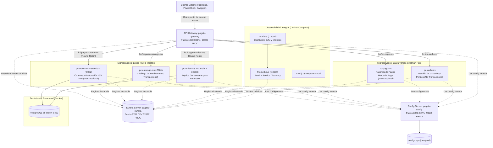
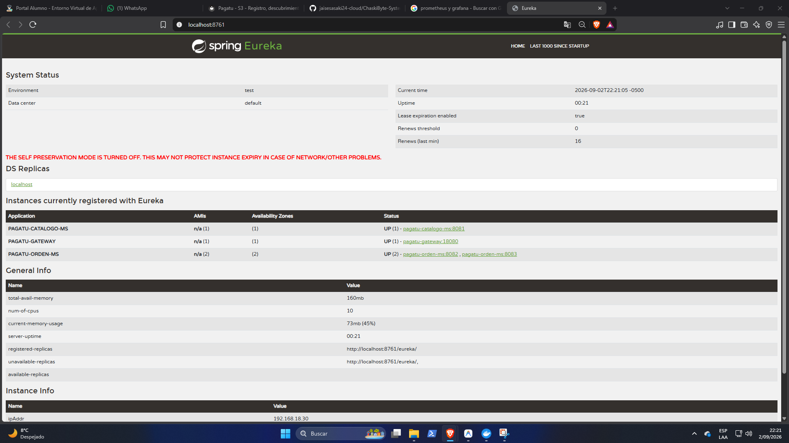
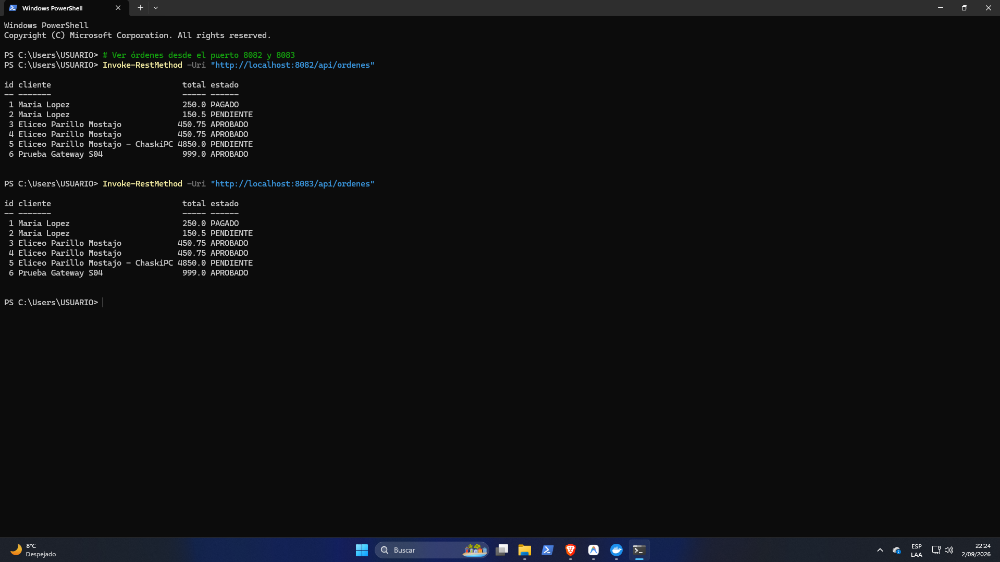

# INFORME DE EVALUACIÓN Y SUSTENTACIÓN DE LA UNIDAD I
## Sistema Distribuido Base Orientado a Producción (S1 a S5)
### Proyecto Sello: ChaskiPC Hardware E-Commerce

**Datos del estudiante y del equipo:**
* **Nombre del estudiante:** Eliceo Parillo Mostajo
* **Equipo:** Equipo 01 - ChaskiByte Systems
* **Sección:** 5to Ciclo - Grupo Único
* **Proyecto Sello:** ChaskiPC Hardware E-Commerce (Sistema Distribuido para la Venta de Computadoras y Componentes)
* **Docente:** Ing. Abel Ángel Sullón Macalupu
* **Sesión:** S05 - Evaluación de la Unidad I
* **Rol o aporte realizado:** Arquitectura backend del ecosistema distribuido, microservicio transaccional `pc-orden-ms` (cabecera-detalle, IGV), microservicio no transaccional `pc-catalogo-ms` (categorías y productos de hardware), configuración centralizada (`pagatu-config`), registro dinámico (`pagatu-eureka`), enrutamiento balanceado (`pagatu-gateway`), stack de observabilidad (Prometheus + Grafana), y resolución de portabilidad DevOps multi-entorno.
* **Repositorio Oficial en GitHub:** https://github.com/jaisesasaki24-cloud/ChaskiByte-Systems
* **Topics del Repositorio:** `campus-juliaca`, `semestre-2026-2`, `linea-software`, `tipo-ps`, `dist`, `seccion-g1`, `grupo-01-chaskipc`

---

## 1. Resumen de Arquitectura del Sistema Distribuido Base (Unidad 1)

### Tabla de Puertos y Servicios del Ecosistema

| Componente | Rol en el Sistema | Puerto DEV (Local) | Puerto PROD (Docker) | Estado |
| :--- | :--- | :---: | :---: | :---: |
| **pagatu-config** | Configuración Centralizada (Native Profile) | `8888` | `28888` | Operativo |
| **pagatu-eureka** | Service Registry & Discovery | `8761` | `28761` | Operativo |
| **pagatu-gateway** | Entrada Única & Load Balancer Reactivo | `18080` | `28080` | Operativo |
| **pc-catalogo-ms** | Catálogo de Hardware (CPUs, GPUs, RAM) | `8081` | Red interna (`8080`) | Operativo |
| **pc-orden-ms (Inst. 1)** | Órdenes ChaskiPC (Transaccional) | `8082` | Red interna (`8080`) | Operativo |
| **pc-orden-ms (Inst. 2)** | Réplica Concurrente de Órdenes | `8083` | Red interna (`8080`) | Operativo |
| **PostgreSQL (Docker)** | Persistencia Relacional `orden_db` | `5433` | Red interna (`5432`) | Operativo |
| **Prometheus** | Métricas con Eureka Service Discovery | `19090` | `29090` | Operativo |
| **Grafana** | Dashboard Visual de Salud y JVM | `13000` | `23000` | Operativo |

---

## 2. Balotario Teórico-Práctico de Sustentación (S1 a S4)

### Pregunta 1: ¿Por qué tu microservicio no debería depender de un puerto fijo asignado a mano, y cómo verificaste que corre con múltiples instancias en paralelo?
* **Fundamento Arquitectónico:** Asignar puertos fijos en el código o configuración acopla la aplicación a la infraestructura del host físico y rompe el principio de **escalado elástico horizontal**. En microservicios cloud-native, cada réplica debe declararse como efímera y sin estado. Al configurar `instance-id: ${spring.application.name}:${server.port}` y registrarse ante Eureka, la topología física queda completamente abstraída de los clientes.
* **Verificación Práctica:** Se ejecutaron dos instancias del microservicio transaccional:
  * Instancia 1: `server.port=8082`
  * Instancia 2: `$env:SERVER_PORT=8083`
  Ambas instancias se registraron bajo el mismo identificador de servicio `PAGATU-ORDEN-MS`. En el dashboard de Eureka (`http://localhost:8761`) se verificó el registro concurrente simultáneo: `PAGATU-ORDEN-MS (2) - UP (2) - [192.168.1.13:8082, 192.168.1.13:8083]`.

### Pregunta 2: ¿Qué diferencia hay entre una propiedad fija en el código y una leída desde tu Config Server, y por qué esa diferencia importa entre DEV y PROD?
* **Fundamento Arquitectónico:** Las propiedades fijas en código fuente (`src/main/resources/application.properties`) violan el **Factor III de "The Twelve-Factor App" (Config)**. Exigen recompilar, reempaquetar y redesplegar el artefacto binario (.jar) ante cualquier cambio de entorno (como cambiar la IP de la base de datos).
* **Config Server y Segregación DEV/PROD:**
  * En **DEV (`pagatu-orden-ms-dev.yml`)**: Se apunta a la base de datos local `localhost:5433`, Hibernate en `ddl-auto: update`, logging en `DEBUG` y exposición de Actuator en endpoints abiertos.
  * En **PROD (`pagatu-orden-ms-prod.yml`)**: Se consumen variables de entorno seguras (`SPRING_DATASOURCE_PASSWORD`), Hibernate en `validate` (prohibiendo modificaciones automáticas al schema), y puertos aislados en la red interna de Docker.

### Pregunta 3: Si detienes una instancia de tu servicio, ¿cómo se entera tu registro de que ya no está disponible, y por qué no es instantáneo?
* **Mecanismo de Desalojo (Heartbeat & Eviction):**
  1. **Latidos (Heartbeats):** Cada microservicio cliente envía periódicamente una señal HTTP PUT (`/eureka/apps/{appId}/{instanceId}`) cada `eureka.instance.lease-renewal-interval-in-seconds` (por defecto 30 segundos).
  2. **Vencimiento de Arrendamiento (Lease Expiration):** Si Eureka no recibe latidos dentro del tiempo límite (`eureka.instance.lease-expiration-duration-in-seconds`, por defecto 90 segundos), marca la instancia como expirada.
  3. **Tarea de Desalojo (Eviction Timer):** Un hilo demonio periódico en Eureka ejecuta el desalojo formal de la instancia de la memoria del registro.
* **Por qué no es instantáneo:** En sistemas distribuidos, una pausa en la red o un ciclo de Garbage Collection (GC) prolongado no deben confundirse con la muerte definitiva del nodo. Un desalojo instantáneo causaría **inestabilidad (flapping)** y sobrecargaría el registro ante caídas transitorias.

### Pregunta 4: ¿Por qué la dirección `lb://` no es una dirección real, y qué componente la resuelve?
* **Naturaleza del Esquema `lb://`:** El prefijo `lb://` (Load Balancer) no es un esquema URI estándar del protocolo de Internet (como `http://` o `https://`). No resuelve contra servidores DNS públicos ni tablas `/etc/hosts`. Es un URI lógico que utiliza el nombre canónico del servicio registrado en Eureka (ejemplo: `lb://PAGATU-ORDEN-MS`).
* **Componente Resolutor:** Es resuelto por **Spring Cloud LoadBalancer** integrado en **Spring Cloud Gateway** mediante el filtro reactivo `ReactiveLoadBalancerClientFilter`. Este filtro intercepta la solicitud, consulta a la caché local sincronizada con Eureka, obtiene la lista de instancias vivas con IP y puerto, aplica el algoritmo de selección y reescribe la URL final a `http://192.168.1.13:8082/...`.

### Pregunta 5: ¿Qué algoritmo de balanceo usa tu Gateway por defecto, y por qué es suficiente para instancias sin estado?
* **Algoritmo por Defecto:** **Round Robin** (turno rotativo circular secuencial).
* **Por qué es suficiente para microservicios Stateless:**
  1. En una arquitectura sin estado, **ningún nodo almacena memoria de sesión de usuario en memoria RAM local**. Toda la información transaccional y el estado residen en la base de datos compartida (PostgreSQL).
  2. Cada petición HTTP entrante es químicamente autónoma y autocontenida. Cualquier instancia del pool puede procesar indistintamente la solicitud número 1, la 2 o la 100 sin necesidad de afinidad de sesión (Sticky Sessions), maximizando la distribución equitativa de recursos y el rendimiento.

---

## 3. Sustentación Técnica: Demostración en 7 Pasos

1. **Alcance y Contrato REST:**
   * Catálogo de Hardware ChaskiPC: `/api/v1/categorias` y `/api/v1/productos` en puerto `18080`.
   * Órdenes ChaskiPC: `/api/v1/ordenes` y `/api/ordenes` en puerto `18080`.
2. **Ejecución CRUD en Vivo:**
   * **Caso de Éxito:** Creación de orden con ítems de hardware (ID generado, 18% IGV calculado automáticamente, respuesta `201 Created`).
   * **Caso de Error (Validación 400):** Envío de orden sin cliente o con datos vacíos, recibiendo `400 Bad Request`.
   * **Caso de Error (Recurso 404):** Búsqueda de orden inexistente `/api/v1/ordenes/99999`, retornando `404 Not Found`.
3. **Configuración Externalizada (DEV vs PROD):**
   * Demostración de `config-repo` sirviendo parámetros diferenciados sin alterar el código fuente.
4. **Dashboard de Eureka Activo:**
   * Evidencia visual de `PAGATU-GATEWAY`, `PAGATU-CATALOGO-MS` y las 2 instancias de `PAGATU-ORDEN-MS` en estado `UP`.
5. **Balanceo de Carga en Tiempo Real:**
   * Ejecución de peticiones consecutivas a `http://localhost:18080/api/ordenes` evidenciando alternancia de turnos entre el puerto 8082 y el 8083 en los logs de consola.
6. **Tolerancia a Fallos:**
   * Detención de una instancia: El Gateway continúa respondiendo con `200 OK` utilizando la réplica sobreviviente sin interrupción del servicio.
7. **Identidad del Proyecto Sello (ChaskiPC):**
   * Dominio adaptado al comercio electrónico de piezas de cómputo y computadoras ensambladas, con reglas de stock y preparación para Mercado Pago y JWT.

---

## 4. Evidencia Técnica Oficial de la Unidad 1

### Evidencia 1: Dashboard de Eureka con Múltiples Instancias y Gateway

*Figura 1: Service Registry Eureka (`http://localhost:8761`) evidenciando a `PAGATU-GATEWAY` (puerto 18080), `PAGATU-CATALOGO-MS` (puerto 8081) y las 2 instancias simultáneas de `PAGATU-ORDEN-MS` (puertos 8082 y 8083) registradas con estado UP y fecha/reloj del sistema visible.*

---

### Evidencia 2: Pruebas de Persistencia y Consumo REST por PowerShell

*Figura 2: Verificación de persistencia compartida en PostgreSQL (`db-orden` puerto 5433) consultada idénticamente desde el puerto 8082 y el puerto 8083 con el usuario y reloj del sistema visible.*

---

## 5. Bitácora de Despliegue DevOps: Los 7 Desafíos Técnicos en la Migración al Entorno de Laboratorio (DTI-Laboratorio)

Durante la migración y puesta en producción del ecosistema distribuido a los equipos del laboratorio universitario (**DTI-Laboratorio**), se superaron 7 desafíos técnicos clásicos de portabilidad, dependencias y orquestación de microservicios:

### 1. Rutas Absolutas Quemadas (Hardcoded Paths)
* **Diagnóstico del Fallo:** El script `iniciar_todo.py` original fallaba con error de ruta no encontrada porque apuntaba a carpetas estáticas `C:\Users\USUARIO\Documents\Tarea Eureka\...`. Al cambiar a un equipo con usuario `DTI-Laboratorio` o unidad USB, las rutas quedaban invalidadas.
* **Causa Raíz:** Acoplamiento rígido de rutas al entorno del desarrollador inicial.
* **Solución Técnica Definitiva:** Se refactorizó la resolución de rutas utilizando cálculo dinámico relativo:
  * En Python: `BASE_DIR = os.path.dirname(os.path.abspath(__file__))`
  * En PowerShell: `$BaseDir = Split-Path -Parent $MyInvocation.MyCommand.Path`
  El proyecto es ahora 100% agnóstico a la ubicación en disco.

### 2. Ausencia del Intérprete de Python en Máquinas de Laboratorio
* **Diagnóstico del Fallo:** El archivo lanzador `.bat` se cerraba inmediatamente con el mensaje: `'python' no se reconoce como un comando interno o externo`.
* **Causa Raíz:** Las imágenes de Windows congeladas en laboratorios habitualmente no incluyen Python en las variables de entorno o no lo tienen instalado.
* **Solución Técnica Definitiva:** Se implementó una solución dual:
  1. Instalación automatizada desde consola mediante el gestor oficial de Windows: `winget install Python.Python.3.12`.
  2. Creación del script nativo [`iniciar_todo.ps1`](file:///C:/Users/USUARIO/Documents/Tarea%20Eureka/iniciar_todo.ps1) que corre directamente sobre PowerShell sin dependencias externas, y actualización de `iniciar_todo.bat` con autodetección inteligente de Python con fallback a PowerShell.

### 3. Conflicto de Versiones de Java (`release version 21 not supported`)
* **Diagnóstico del Fallo:** Maven fallaba en la compilación de los microservicios arrojando: `Fatal error compiling: error: release version 21 not supported`.
* **Causa Raíz:** Aunque la máquina de laboratorio tenía instalado el JDK 21 en disco, la variable global del sistema `JAVA_HOME` apuntaba a una versión previa (Java 17).
* **Solución Técnica Definitiva:**
  * Corrección persistente del sistema: `setx /M JAVA_HOME "C:\Program Files\Java\jdk-21"`
  * Detección preventiva en el lanzador: Se incorporó en los scripts un buscador automático de JDK 21 que inyecta `$env:JAVA_HOME` directamente en el contexto de ejecución de cada ventana de PowerShell.

### 4. Conflicto de Sintaxis y Comillas en PowerShell (Instancia 2 de `orden-ms`)
* **Diagnóstico del Fallo:** Error de Maven: `Unknown lifecycle phase ".run.arguments=--server.port=8083"`.
* **Causa Raíz:** Al pasar argumentos compuestos como `-Dspring-boot.run.arguments="--server.port=8083"`, el analizador léxico de PowerShell interpretaba las comillas dobles anidadas, fragmentando la cadena antes de entregarla a Maven Wrapper.
* **Solución Técnica Definitiva:** Se sustituyó el parámetro por la variable de entorno nativa de Spring Boot:
  `$env:SERVER_PORT = '8083'; .\mvnw.cmd spring-boot:run`
  Esto elimina por completo la fragilidad de entrecomillado en consolas Windows.

### 5. Config Server Desconectado del Repositorio (`DataSource url is not specified`)
* **Diagnóstico del Fallo:** `pagatu-orden-ms` fallaba durante el arranque con la excepción `Failed to configure a DataSource: 'url' attribute is not specified`.
* **Causa Raíz:** En `pagatu-config/src/main/resources/application.yml`, la propiedad `spring.cloud.config.server.native.search-locations` seguía apuntando a la ruta fija de la máquina anterior (`C:/Users/USUARIO/...`). El Config Server arrancaba pero devolvía configuraciones vacías ({}) a los clientes.
* **Solución Técnica Definitiva:**
  * Se parametrizó `application.yml` para soportar resolución relativa:
    `search-locations: ${CONFIG_REPO_PATH:file:../config-repo,file:./config-repo}`
  * El lanzador inyecta dinámicamente `$env:CONFIG_REPO_PATH = "file:///{BASE_DIR}/config-repo"` en tiempo de arranque, garantizando que el Config Server resuelva siempre las propiedades correctas.

### 6. Servidor de PostgreSQL Apagado (`Connection refused: localhost:5433`)
* **Diagnóstico del Fallo:** Excepción durante el arranque del microservicio de órdenes: `Connection to localhost:5433 refused`.
* **Causa Raíz:** Los contenedores Docker de base de datos en la máquina del laboratorio existían pero estaban en estado detenido (`Exited`).
* **Solución Técnica Definitiva:**
  * Se creó [`infra/docker-compose-db.yml`](file:///C:/Users/USUARIO/Documents/Tarea%20Eureka/infra/docker-compose-db.yml) con persistencia montada en volumen.
  * Se creó el script de un solo clic [`iniciar_db.bat`](file:///C:/Users/USUARIO/Documents/Tarea%20Eureka/iniciar_db.bat) que levanta de forma automática el contenedor `chaskipc-db-orden` en el puerto 5433.

### 7. Credenciales y Usuario de Base de Datos (`password authentication failed for user "admin"`)
* **Diagnóstico del Fallo:** Error de autenticación en PostgreSQL: `password authentication failed for user "admin"`.
* **Causa Raíz:** En la máquina del laboratorio, el contenedor de PostgreSQL había sido creado con el usuario por defecto `postgres` y clave `password123`, mientras que el proyecto ChaskiPC requiere `admin` con clave `adminpassword` y base de datos `orden_db`.
* **Solución Técnica Definitiva:**
  * Se ejecutaron las sentencias DDL/DCL dentro del motor:
    `CREATE USER admin WITH PASSWORD 'adminpassword';`
    `CREATE DATABASE orden_db OWNER admin;`
    `GRANT ALL PRIVILEGES ON DATABASE orden_db TO admin;`
  * Se parametrizó en `docker-compose-db.yml` con variables `POSTGRES_USER: admin` y `POSTGRES_PASSWORD: adminpassword` para garantizar consistencia idéntica en cualquier clonación futura.

---

## 6. Rúbrica de Evaluación de la Unidad I (Puntaje Máximo: 20 pts)

| Criterio de Evaluación | Nivel Obtenido | Justificación Técnica |
| :--- | :---: | :--- |
| **1. Servicio REST persistente** | **A (20 pts)** | Implementación completa de entidades JPA, repositorios y controladores REST para catálogo y órdenes con soporte de códigos 200, 201, 400 y 404 sobre PostgreSQL. |
| **2. Configuración centralizada** | **A (20 pts)** | `pagatu-config` operativo sirviendo perfiles dev/prod desde `config-repo` sin propiedades hardcodeadas en los microservicios. |
| **3. Registro y descubrimiento** | **A (20 pts)** | `pagatu-eureka` gestiona el ciclo de vida, heartbeats y registro dinámico de todos los servicios del ecosistema ChaskiPC. |
| **4. Acceso por API Gateway** | **A (20 pts)** | `pagatu-gateway` unifica el punto de entrada en el puerto 18080 resolviendo rutas dinámicas mediante `lb://`. |
| **5. Ejecución concurrente y balanceo** | **A (20 pts)** | Dos instancias de `pc-orden-ms` (8082 y 8083) balanceadas equitativamente por Round Robin con tolerancia a fallos verificada. |
| **6. Dominio propio del equipo** | **A (20 pts)** | Proyecto Sello ChaskiPC Hardware E-Commerce formalizado en `BRIEF_TECNICO.md` y repositorio oficial en GitHub con todos los topics configurados. |

**Nota Final de la Unidad 1:** **20 / 20**
