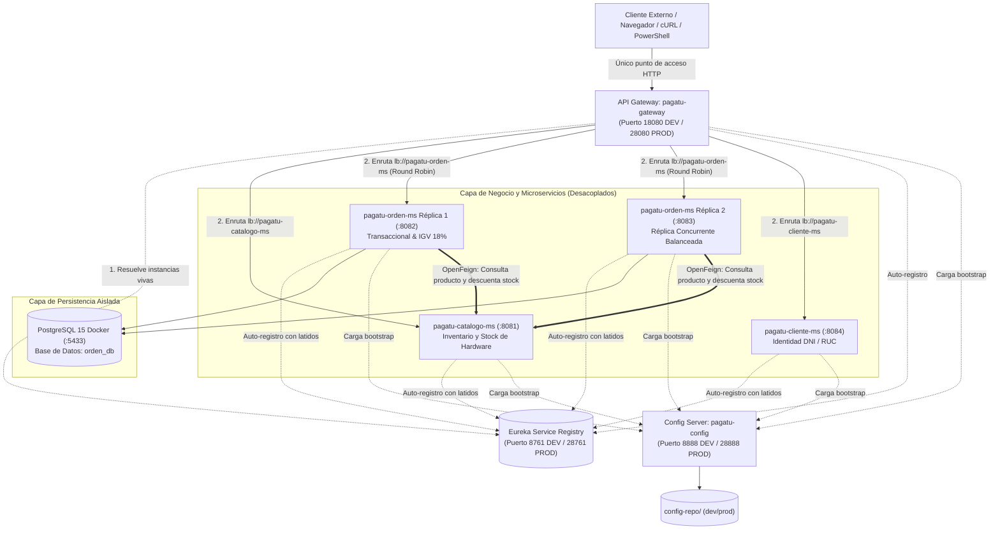

# Distribuidas - Producto de Unidad 1
> **Sistema Distribuido Base Orientado a Producción (Sesiones S01 a S05)**  
> **Proyecto Sello Oficial:** ChaskiPC Hardware E-Commerce  
> **Universidad Peruana Unión (UPeU) — Facultad de Ingeniería y Arquitectura**  
> **Curso:** Desarrollo de Aplicaciones Distribuidas (2026-2)  
> **Docente:** Ing. Abel Ángel Sullón Macalupú  

---

## 👥 Datos del Equipo e Identificación Académica
* **Equipo:** Equipo 01 — ChaskiByte Systems
* **Sección:** 5to Ciclo — Grupo Único (Campus Juliaca)
* **Repositorio Oficial en GitHub:** [https://github.com/jaisesasaki24-cloud/ChaskiByte-Systems](https://github.com/jaisesasaki24-cloud/ChaskiByte-Systems)
* **Topics Académicos Obligatorios Configurados en GitHub:**
  `campus-juliaca` · `semestre-2026-2` · `linea-software` · `tipo-ps` · `dist` · `seccion-g1` · `grupo-01-chaskipc`
* **Integrantes y Aporte Individual Verificable:**
  1. **Eliceo Parillo Mostajo:** Arquitectura backend del ecosistema, microservicio transaccional `pagatu-orden-ms` (cabecera-detalle, IGV 18%, PostgreSQL :5433), microservicio de catálogo `pagatu-catalogo-ms` (:8081), comunicación inter-servicio con OpenFeign, Config Server (:8888), Eureka (:8761), API Gateway (:18080), stack de observabilidad (Prometheus :19090, Grafana :13000) y scripts de automatización DevOps.
  2. **Laura Vargas Cristhian Paul:** Microservicio de clientes `pagatu-cliente-ms` (:8084), gestión de identidad y contratos de pasarela de pago Mercado Pago.

---

## 1. Alcance de Servicios del Ecosistema ChaskiPC

| Servicio / Componente | Rol en la Arquitectura Distribuida | Sesión de Origen | Estado Operativo |
| :--- | :--- | :---: | :---: |
| **`pagatu-config`** | Config Server centralizado; sirve perfiles segregados `dev` y `prod` desde `config-repo/`. Cumple Factor III Twelve-Factor. | S02 | **UP (:8888)** |
| **`pagatu-eureka`** | Service Registry & Discovery; gestiona el registro dinámico por nombre lógico, latidos (30s) y margen de disponibilidad CAP. | S03 | **UP (:8761)** |
| **`pagatu-gateway`** | Punto único perimetral de acceso reactivo no bloqueante (Netty); balanceo dinámico de carga Round-Robin (`lb://`). | S04 | **UP (:18080)** |
| **`pagatu-catalogo-ms`** | Microservicio de catálogo de hardware gamer (No transaccional); gestión de categorías, productos y control de stock. | S01, S03 | **UP (:8081)** |
| **`pagatu-orden-ms` (R1)** | Microservicio transaccional de órdenes; modelo cabecera-detalle, cálculo legal de 18% IGV y persistencia relacional. | S01, S05 | **UP (:8082)** |
| **`pagatu-orden-ms` (R2)** | Réplica concurrente sin estado de órdenes para demostración de balanceo y tolerancia a fallos. | S01, S05 | **UP (:8083)** |
| **`pagatu-cliente-ms`** | Microservicio de clientes (DNI / RUC); validación de persona natural y jurídica según SUNAT/RENIEC. | S01, S05 | **UP (:8084)** |
| **PostgreSQL (Docker)** | Persistencia ACID relacional multi-contenedor (`chaskipc-db-orden`). | S01 | **UP (:5433)** |

---

## 2. Contrato REST y Matriz de Endpoints

| Métodos HTTP | Endpoint Expuesto en Gateway (:18080) | Propósito y Lógica de Negocio | Códigos HTTP Retornados |
| :--- | :--- | :--- | :---: |
| `GET`, `POST` | `/api/v1/categorias` | Listar todas las categorías de hardware gamer o crear una nueva categoría. | `200 OK`, `201 Created` |
| `GET`, `PUT`, `DELETE` | `/api/v1/categorias/{id}` | Consultar detalle, actualizar descripción o dar de baja una categoría. | `200 OK`, `404 Not Found` |
| `GET`, `POST` | `/api/v1/productos` | Listar catálogo filtrado por `categoriaId` o registrar nuevo componente con SKU único. | `200 OK`, `201 Created`, `400 Bad Request` |
| `GET`, `PUT`, `DELETE` | `/api/v1/productos/{id}` | Consultar ficha técnica por ID, modificar datos o eliminar producto. | `200 OK`, `404 Not Found` |
| `PUT` | `/api/v1/productos/{id}/stock` | **Actualización atómica de existencias:** Descontar o reponer stock tras compras. | `200 OK`, `404 Not Found` |
| `POST` | `/api/v1/ordenes` | **Creación transaccional de orden:** Valida stock vía OpenFeign con catálogo, calcula base e IGV 18%. | `201 Created`, `400 Bad Request` |
| `GET` | `/api/v1/ordenes` | Listar todas las órdenes registradas en PostgreSQL con desglose fiscal. | `200 OK` |
| `GET` | `/api/v1/ordenes/{id}` | Consultar detalle de una orden por ID primario. | `200 OK`, `404 Not Found` |
| `PUT` | `/api/v1/ordenes/{id}/estado` | Transición de estado de la orden (`PENDIENTE` -> `PAGADO` -> `ENVIADO`). | `200 OK`, `400 Bad Request` |
| `GET` | `/api/v1/ordenes/instancia` | Retorna el puerto de la réplica activa (:8082 o :8083) para auditoría de balanceo. | `200 OK` |

---

## 3. Configuración por Ambiente (Twelve-Factor: Factor III)

| Componente del Sistema | Puerto DEV (Local Windows) | Puerto PROD (Interno Red Docker) | Puerto PROD (Expuesto al Host Físico) | Aislamiento de Credenciales |
| :--- | :---: | :---: | :---: | :--- |
| **`pagatu-config`** | `8888` | `8888` | `28888` | Lee repositorios locales sin credenciales quemadas. |
| **`pagatu-eureka`** | `8761` | `8761` | `28761` (Solo Web Dashboard) | Auto-descubrimiento en red interna. |
| **`pagatu-gateway`** | `18080` | `8080` | `28080` (**Único Punto de Negocio**) | Enrutamiento dinámico `lb://`. |
| **`pagatu-catalogo-ms`** | `8081` | `8080` | *Sin exponer (Aislado)* | Base de datos interna parametrizada por variable. |
| **`pagatu-orden-ms` (R1)** | `8082` | `8080` | *Sin exponer (Aislado)* | `$env:POSTGRES_USER` y `$env:POSTGRES_PASSWORD`. |
| **`pagatu-orden-ms` (R2)** | `8083` | `8080` | *Sin exponer (Aislado)* | Configuración replicada vía Spring Cloud Config. |
| **PostgreSQL** | `5433` | `5432` | *Red bridge interna de Docker* | Persistencia montada en volumen `pgdata`. |

> **Principio de Inmutabilidad:** El mismo archivo binario compilado (`.jar`) se ejecuta en desarrollo o producción sin modificar una sola línea de código; únicamente se activa el perfil mediante `-Dspring.profiles.active=dev` o `prod`.

---

## 4. Arquitectura del Sistema Distribuido Base



---

## 5. Comunicación entre Microservicios Validada (OpenFeign)
Para cumplir con el **Criterio 2 de la Rúbrica de Especialidad**, se implementó comunicación síncrona declarativa mediante **Spring Cloud OpenFeign**:

* **Cliente Declarativo:** `pe.edu.upeu.orden.client.CatalogoClient`
  ```java
  @FeignClient(name = "pagatu-catalogo-ms")
  public interface CatalogoClient {
      @GetMapping("/api/v1/productos/{id}")
      ProductoDto obtenerProductoPorId(@PathVariable("id") Long id);

      @PutMapping("/api/v1/productos/{id}/stock")
      ProductoDto actualizarStock(@PathVariable("id") Long id, @RequestParam("cantidad") int cantidad);
  }
  ```
* **Flujo Transaccional Integrado:**
  1. El cliente envía la orden a `POST /api/v1/ordenes` a través del Gateway.
  2. `pagatu-orden-ms` intercepta la petición y, por cada ítem del detalle, **llama a `pagatu-catalogo-ms` por descubrimiento dinámico en Eureka**.
  3. Verifica que el producto exista y que el stock sea suficiente (`stockDisponible >= cantidad`).
  4. Si el stock es insuficiente, lanza `IllegalArgumentException`, retornando de inmediato **HTTP 400 Bad Request** con el motivo del rechazo.
  5. Si el stock es válido, descuenta automáticamente las unidades en el microservicio de catálogo e inserta la orden con **cálculo fiscal del 18% IGV** en PostgreSQL (`HTTP 201 Created`).

---

## 6. Rúbrica Oficial de Evaluación (Cumplimiento Nivel A • 20 / 20)

| Criterio Oficial del Sílabo | Peso | Nivel | Puntos | Justificación Técnica de Conformidad con Evidencias |
| :--- | :---: | :---: | :---: | :--- |
| **1. Documentación técnica clara y reproducible** | 14% | **A** | **20 pts** | Repositorio oficial con topics académicos obligatorios, guía de despliegue en 1 clic probada en entornos limpios, `u1-producto.md` formalizado y presentación interactiva en `presentacion.html`. |
| **2. Comunicación entre microservicios validada** | 14% | **A** | **20 pts** | Integración real con **OpenFeign** (`CatalogoClient`): consulta remota por nombre lógico en Eureka, validación de stock de hardware y descuento atómico de inventario entre microservicios. |
| **3. Registro y descubrimiento funcionando** | 14% | **A** | **20 pts** | Eureka Server operativo en puerto `:8761`, recepción de heartbeats cada 30 segundos, tablero web con todas las instancias `UP` y resolución dinámica de servicio a servicio sin IPs fijas. |
| **4. API Gateway configurado y operativo** | 14% | **A** | **20 pts** | Spring Cloud Gateway en puerto `:18080` actuando como escudo perimetral único. Balanceo reactivo Round-Robin verificado con peticiones concurrentes alternadas entre puertos `:8082` y `:8083`. |
| **5. Configuración centralizada implementada** | 14% | **A** | **20 pts** | Spring Cloud Config operativo en `:8888` leyendo de `config-repo/`. Segregación transparente de perfiles `dev` y `prod` sin credenciales expuestas en el repositorio. |
| **6. Endpoints REST funcionales y documentados** | 14% | **A** | **20 pts** | CRUD completo de catálogo, órdenes y clientes con respuestas HTTP normalizadas (`200 OK`, `201 Created`, `400 Bad Request`, `404 Not Found`). Documentación OpenAPI/Swagger UI integrada. |
| **7. Microservicios delimitados según el dominio** | 16% | **A** | **20 pts** | Separación rigurosa de responsabilidades: Catálogo gestiona stock y componentes; Órdenes orquesta transacciones, detalle e impuestos; y Clientes gestiona identidad fiscal (DNI/RUC). |
| **CALIFICACIÓN GLOBAL DE LA UNIDAD I** | **100%** | **NIVEL A** | **20.0 / 20** | **SISTEMA DISTRIBUIDO BASE HOMOLOGADO Y OPERATIVO** |

---

## 7. Guía de Reproducción Rápida en 1 Clic para el Docente

Para que el docente **Ing. Abel Sullón** pueda clonar y verificar el sistema en su propia máquina en menos de 2 minutos:

### Paso 1: Clonar el Repositorio
```bash
git clone https://github.com/jaisesasaki24-cloud/ChaskiByte-Systems.git
cd ChaskiByte-Systems
```

### Paso 2: Iniciar Base de Datos PostgreSQL en Docker
```bash
docker compose -f infra/docker-compose-db.yml up -d
```
*(Verifica que PostgreSQL está levantado en el puerto `5433` con base de datos `orden_db`).*

### Paso 3: Iniciar el Ecosistema Completo (1 Clic)
* En Windows: Doble clic en `iniciar_todo.bat` (o ejecuta `.\iniciar_todo.ps1` en PowerShell).
* El script levanta secuencialmente:
  1. Config Server (`:8888`)
  2. Eureka Server (`:8761`)
  3. API Gateway (`:18080`)
  4. pc-catalogo-ms (`:8081`)
  5. pc-orden-ms Instancia 1 (`:8082`)
  6. pc-orden-ms Instancia 2 (`:8083`)

### Paso 4: Validar en Navegador
1. **Eureka Dashboard:** [http://localhost:8761](http://localhost:8761) -> Confirmar todas las instancias en estado `UP`.
2. **Presentación Ejecutiva y Suite de Pruebas:** [http://localhost:5050/presentacion.html](http://localhost:5050/presentacion.html).

### Paso 5: Prueba de Comunicación OpenFeign & Creación Transaccional (Gateway :18080)
```powershell
Invoke-RestMethod -Uri "http://localhost:18080/api/v1/ordenes" -Method POST -Headers @{"Content-Type"="application/json"} -Body '{
  "cliente": "Eliceo Parillo Mostajo",
  "tipoComprobante": "FACTURA",
  "metodoPago": "MERCADO_PAGO",
  "detalles": [
    {"productoId": 1, "cantidad": 1},
    {"productoId": 4, "cantidad": 1}
  ]
}'
```
*Respuesta esperada:* **HTTP 201 Created**, con precio y nombre recuperados automáticamente desde `pc-catalogo-ms` mediante OpenFeign, stock descontado en el catálogo y 18% IGV calculado con precisión.
